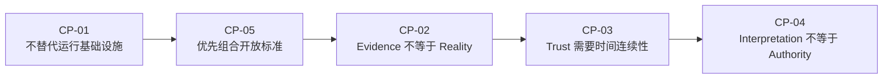

# SAEE Constitution Principles Candidates

中文名称：SAEE 开发宪法未来原则候选<br>
版本：`v1.0`<br>
日期：`2026-07-17`<br>
文档类型：`NON_AUTHORITATIVE_RESEARCH_CANDIDATES`<br>
候选来源：`SAEE_TRUST_INFRASTRUCTURE_COMPETITIVE_LANDSCAPE.md`

```text
CURRENT_CONSTITUTION_AUTHORITY=SAEE_DEVELOPMENT_CONSTITUTION_V1.1
CANDIDATE_STATUS=PROPOSED_FOR_HUMAN_REVIEW
CANDIDATE_COUNT=5
THIS_DOCUMENT_IS_CONSTITUTIONAL_AUTHORITY=false
CONSTITUTION_AMENDMENT_EXECUTED=false
CURRENT_CAPABILITY_CHANGED=false
FUTURE_DIRECTION_ONLY=true
```

## 1. 文档地位

本文提炼竞争版图中可能长期有效的五条原则，供未来决定是否进入 `SAEE Development Constitution`。它不是宪法修订、DCP 批准、工程授权、产品承诺或能力实现。

候选原则只解决长期边界，不把以下时变内容写入宪法：

- 具体厂商、产品、价格或市场份额；
- 当前竞争地图坐标；
- 未验证的商业 packaging；
- 具体 Schema、MCP Tool、API 或实现架构；
- 对未来 SAEE 已实现 Trust Infrastructure 的暗示。

候选 ID `TRUST-CP-01` 至 `TRUST-CP-05` 仅在本文内有效，不是 canonical registry ID。

## 2. 候选原则一：运行基础设施非替代原则

### `TRUST-CP-01 — Execution Infrastructure Non-Replacement Principle`

> SAEE 可以消费并解释 Agent Framework、协议、Observability、IAM、Policy Engine 和外部系统产生的信号，但不得以可信解释为理由替代其运行、通信、身份、授权、监控、策略执行或人工权力职责。

### 为什么长期有效

未来技术栈会变化，但“解释证据”与“执行世界”之间的权力分离不会过时。该原则使 SAEE 能组合新标准，而不因某个具体协议的兴衰改变项目边界。

### 防止的漂移

- 把 SAEE 重构成通用 Agent Framework；
- 为获得数据而接管 runtime、tool execution 或 workflow；
- 把 evaluation 结果自动升级为控制动作；
- 与成熟运行基础设施重复建设。

### 与现行宪法关系

与当前“数字生物可以观察外部世界，但不能直接执行外部世界”、非通用 Agent Framework、Evidence/Immune Subsystem 不是项目核心等原则一致。若未来进入宪法，应作为既有边界的长期 Trust Infrastructure 扩展，而不是重写项目身份。

### Non-Claims

该原则不声称 SAEE 已连接或兼容任何 Framework、OTel、IAM、MCP、A2A 或 Governance Platform。

## 3. 候选原则二：证据与现实分离原则

### `TRUST-CP-02 — Evidence-Reality Separation Principle`

> Evidence 只能在其来源、完整性、适用范围、时间边界和缺失项内支持明确 claim；日志、trace、签名、receipt、evaluation 或登记记录均不得被自动等同于现实本身、事件真相或完整责任事实。

### 为什么长期有效

任何证据系统都只能观察、声明或证明现实的一部分。随着 Agent 自主性和系统复杂度提高，证据数量会增加，但采集盲区、错误声明、语义错配和不完整因果链也会增加。

### 防止的漂移

- “有日志即有证据”；
- “签名有效即内容真实”；
- “trace 完整即责任完整”；
- “evaluation pass 即长期可信”；
- 用一个总分掩盖反证和缺失证据。

### 与现行宪法关系

延伸 staged truth、provenance、evidence quality 和 non-claim 纪律，也与 SCITT 对“声明被登记”和“声明准确性”的区分一致。

### Non-Claims

该原则不否定 logs、traces、signatures 或 receipts 的价值；它要求这些材料只能在明确边界内使用。

## 4. 候选原则三：可信时间连续性原则

### `TRUST-CP-03 — Temporal Trust Continuity Principle`

> Trust 不是一次性属性。任何依赖身份、角色、委托、目标、状态、上下文、记忆、能力或治理条件的可信判断，都必须在这些条件发生实质变化时重新解释；过去的通过、授权或证据不得自动永久继承。

### 为什么长期有效

长期 Agent 的根本变化不是运行时间更长，而是信任前提会被不断更新。模型、工具、记忆、数据、角色、目标和组织政策均可能变化；静态认证和单次测试无法覆盖这种累积变化。

### 防止的漂移

- 单次 readiness test 被描述为长期保障；
- 初始身份认证被扩张为持续行为可信；
- 旧目标、旧授权和旧 evidence 被无条件继承；
- state/memory/goal drift 被当作普通运行噪音。

### 与现行宪法关系

这是五条中新增语义最强的未来候选。它与 Archive/Rollback Immune System、staged truth 和 controlled change 相容，但当前不意味着 SAEE 已实现 State、Memory 或 Goal Integrity。

### Non-Claims

该原则不定义状态模型、重新评估周期、数据结构或 reauthorization 机制。

## 5. 候选原则四：可信解释与权力分离原则

### `TRUST-CP-04 — Trust Interpretation Is Not Authority Principle`

> SAEE 的可信解释、evidence adequacy、risk signal、recommendation 或 readiness 结论，只能作为有限决策上下文；不得自动授予权限、执行动作、批准自身变化、认定合规、分配法律责任或替代 Human Authority。

### 为什么长期有效

能够解释风险的系统若同时拥有执行与自我批准权，会形成自证、自授权和责任集中。无论未来自动化程度多高，解释层都必须保留可复核边界，并把 consequential action 交给独立权力主体。

### 防止的漂移

- evaluator 批准自己的变更；
- trust score 直接触发不可逆外部动作；
- recommendation 被称为 authorization；
- 技术 evidence 被升级为法律责任裁决；
- Governance 成为未经授权的项目主线。

### 与现行宪法关系

与自指治理限制、Human Authority、non-authority、evidence system 不能成为自己的 judge 等现行原则直接一致。未来若进入宪法，应统一 Trust Semantic、Evidence 与 Evaluation 的权力边界。

### Non-Claims

该原则不阻止外部 Policy Engine 或 Human Authority 使用 SAEE 输出作决定；它只禁止 SAEE 输出自行成为权力来源。

## 6. 候选原则五：标准组合优先原则

### `TRUST-CP-05 — Standards Composition Before Protocol Substitution Principle`

> 当开放标准或规范基础设施已经承接身份、遥测、可验证声明、连接、通信或授权问题时，SAEE 应优先复用、映射和组合，并显式保留来源与限制；只有在经验证的缺口无法通过组合解决时，才可提出新的协议或契约，而且必须通过独立的重复建设、互操作和权力边界审查。

### 为什么长期有效

可信基础设施的价值来自跨系统可验证，而不是私有协议数量。OTel、SPIFFE、SCITT、MCP、A2A 未来可能变化或被替代，但“先组合成熟标准、后证明新增必要性”的原则持续成立。

### 防止的漂移

- 为类别占位而创建平行协议；
- 把内部 Schema 宣称为行业标准；
- 复制 OTel、IAM、MCP、A2A 或透明日志能力；
- 通过封闭格式制造不可验证的 lock-in；
- 忽略来源系统的真实性和适用性边界。

### 与现行宪法关系

与 duplicate-build prevention、reuse-before-build、provenance、stable contract 和 agent-readable first 一致。该候选把这些工程纪律扩展到未来行业标准组合。

### Non-Claims

该原则不批准任何具体标准集成，也不创建 compatibility profile、Schema 或 MCP 变更。

## 7. 五条原则的联合约束



联合逻辑是：

1. SAEE 不接管执行和控制；
2. 优先从现有标准获得事实和证据；
3. 不把这些证据等同现实；
4. 随时间和状态变化重新解释信任；
5. 解释结果仍不自动成为权力。

缺少任一条都会破坏类别边界：只有连续性而没有 evidence boundary，会产生伪精确；只有 evidence 而没有时间连续性，会退化成日志/收据系统；只有解释而没有 authority separation，会退化成未经授权的治理平台。

## 8. 与现行权威的候选交叉映射

| Candidate | 现行原则基础 | 新增长期价值 | 当前处理 |
|---|---|---|---|
| `TRUST-CP-01` | 非 generic framework；观察而不执行；Evidence 为子系统 | 明确 Trust Infrastructure 与运行/控制栈的边界 | `RESEARCH_ONLY` |
| `TRUST-CP-02` | staged truth、provenance、evidence quality | 把 evidence/reality 分离提升为跨标准原则 | `RESEARCH_ONLY` |
| `TRUST-CP-03` | archive、rollback、controlled change | 引入 identity/goal/state/memory/delegation 的时间连续性 | `RESEARCH_ONLY` |
| `TRUST-CP-04` | Human Authority、自指治理限制、non-authority | 明确 trust interpretation 不得自动授权或裁责 | `RESEARCH_ONLY` |
| `TRUST-CP-05` | duplicate-build、reuse、agent-readable contracts | 把标准组合纪律扩展到行业互操作 | `RESEARCH_ONLY` |

“有现行基础”不等于已经纳入宪法。任何正式变更仍需单独完成权威版本、DCP、推荐门、人类批准、machine contract 和 validator 同步；本文未执行这些动作。

## 9. 宪法、商业宣传与未来研究的分流

| 内容 | 最适合的位置 | 是否建议进入宪法 |
|---|---|---|
| 不替代运行基础设施 | 长期权力边界 | 候选 |
| Evidence 不等于 Reality | 长期证据纪律 | 候选 |
| Trust 需要时间连续性 | 长期类别原则 | 候选，但需审查与 SAEE 核心身份关系 |
| Trust Interpretation 不等于 Authority | 长期治理边界 | 候选 |
| 标准组合优于协议替代 | 长期架构纪律 | 候选 |
| “Trace 不等于 Trust” | 商业解释和行业教育 | 不直接写入；可由上述原则推导 |
| SAEE Competitive Map | 时变战略材料 | 不进入 |
| vendor 对比、价格与商业路径 | 市场研究 | 不进入 |
| State/Memory/Goal continuity 技术机制 | Future research | 当前不进入 |
| 产品、API、Schema、MCP 或集成路线 | 工程决策 | 本阶段禁止 |

## 10. 人工决策问题

正式宪法评审前必须回答：

1. `TRUST-CP-03` 是否强化 Digital Biosphere Evolution Engine 的 archive/rollback immune loop，还是会把项目重新框定为通用 trust platform？
2. `TRUST-CP-01` 与现行“观察世界但不执行世界”是否重复，还是值得作为外部基础设施边界单独表达？
3. `TRUST-CP-04` 应作为通用 Human Authority 条款扩展，还是仅约束 Trust Semantic/Evaluation？
4. `TRUST-CP-05` 的“开放标准”是否应包含事实上的行业规范与 vendor-neutral contract，而不限于正式标准组织？
5. 五条原则应整体进入、部分进入，还是仅保留为未来研究护栏？

## 11. 推荐门结论

```text
CUSTOMER_NEED=LONG_RUNNING_MULTI_AGENT_TRUST_CONTINUITY
WOULD_RECOMMEND_CURRENT_SAEE_PROGRAM=conditional
REASON=CURRENT_SAEE_HAS_BOUNDED_EVIDENCE_AND_EVALUATION_FOUNDATIONS_BUT_NOT_FULL_TRUST_CONTINUITY_INFRASTRUCTURE
DEVELOPMENT_AUTHORIZED=false
RESEARCH_CONTINUATION_ALLOWED=true
```

在潜在客户今天要求完整的多智能体长期运行可信基础设施时，不应把当前 SAEE 推荐为已实现产品。可以有条件地推荐 SAEE 作为 evidence/evaluation 基础与未来架构研究对象，但必须明确当前能力、缺口和非授权边界。

## 12. Final Boundary Check

```text
CANDIDATE_COUNT=5
CANDIDATE_STATUS=PROPOSED_FOR_HUMAN_REVIEW
CURRENT_CONSTITUTION_AUTHORITY_UNCHANGED=true
CONSTITUTION_CHANGED=false
CURRENT_CAPABILITY_UNCHANGED=true
FUTURE_DIRECTION_ONLY=true
CODE_CHANGED=false
MCP_CHANGED=false
SCHEMA_CHANGED=false
NEW_PRODUCTION_CAPABILITY_CREATED=false
CURRENT_SAEE_MAINLINE_UNCHANGED=true
GOAL_INTEGRITY_SECONDARY_LANE=STOPPED
```
