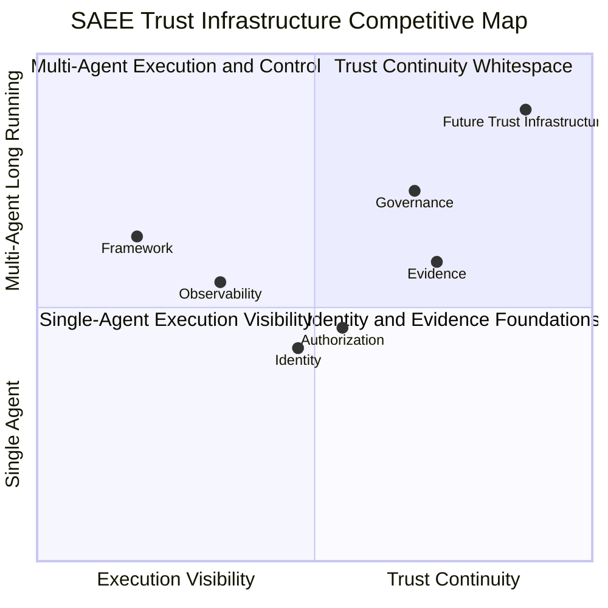
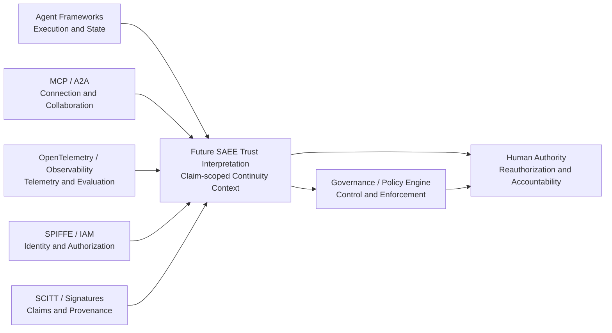

# SAEE Trust Infrastructure Competitive Landscape

## Executive Summary

- **相邻位置已经拥挤，目标空白仍然存在。** Framework、OpenTelemetry、Agent Observability、SPIFFE/SPIRE、SCITT、MCP/A2A 以及企业治理平台，分别解决运行、可见性、身份、声明完整性、连接、协作和控制；它们没有共同回答跨时间、跨 Agent、跨委托链的“为什么现在仍可继续信任”。
- **SAEE 的未来候选位置不是另一个控制平面。** 更准确的空白是 `Multi-Agent Long-Running Trust Continuity Interpretation`（多智能体长期运行可信连续性解释）：关联身份、目标、状态、记忆、证据、委托和治理边界，并对具体 claim 给出有限、可追溯、不自动授权的解释。
- **最强相邻压力来自企业治理平台，而非单一可观测工具。** Observability 正在向评估、告警和自动化扩张，Governance Platform 正在向 Agent inventory、identity、runtime control 和 kill switch 扩张。SAEE 必须把“可信解释”和“权力执行”分开，否则会失去类别边界。
- **商业路径应是标准组合与生态互补。** 未来 SAEE 更适合作为 Framework、OTel、IAM、SCITT、MCP/A2A 和治理平台之间的可信解释层，而不是替代它们。当前只建立类别与合作假设，不主张已有产品、客户、集成或生产能力。

中文名称：SAEE 可信基础设施竞争版图<br>
版本：`v1.0`<br>
日期：`2026-07-17`<br>
文档类型：`FUTURE_STRATEGY_RESEARCH`<br>
研究快照：`2026-07-17`<br>
受众：产品战略、架构、标准、生态合作与投资判断相关方

```text
PROJECT=SAEE_MULTI_AGENT_LONG_RUNNING_TRUST_INFRASTRUCTURE
RESEARCH_STATUS=FUTURE_DIRECTION_ONLY
CURRENT_SAEE_MAINLINE=saee_agent_evidence_integration
CURRENT_CAPABILITY_FACT_SOURCE=capability-package/manifest.json#canonical_inventory
SAEE_CATEGORY_HYPOTHESIS=MULTI_AGENT_LONG_RUNNING_TRUST_INFRASTRUCTURE
SAEE_IS_EXECUTION_LAYER=false
SAEE_IS_AUTHORIZATION_AUTHORITY=false
SAEE_IS_GOVERNANCE_PLATFORM=false
SAEE_FUTURE_POSITION_IS_CURRENT_CAPABILITY=false
GOAL_INTEGRITY_SECONDARY_LANE=STOPPED
MAINLINE_DRIFT_DETECTED=false
```

## 1. 研究目的与判断方法

本文不以“谁和 SAEE 功能相似”为竞争判断，而以未来企业的信任工作被谁承接为判断单位：

1. 谁让 Agent 运行、连接和协作；
2. 谁让执行过程可见；
3. 谁证明主体、声明或来源；
4. 谁制定或执行规则；
5. 谁解释经过长期状态变化后，先前信任是否仍可延续。

对每个类别分别判断：

- `Solved`：它已明确承接的问题；
- `Boundary`：它不承诺或不足以独立解决的问题；
- `Commercial path`：官方已公开的产品或项目路径；
- `Strategic inference`：基于公开事实形成的 SAEE 战略推断，不当作厂商声明；
- `Relationship to SAEE`：替代、竞争、相邻还是合作。

本报告只使用官方规范、项目文档、厂商产品页和官方仓库作为能力事实来源。厂商页面会随版本变化；商业价格和产品状态是研究日期的快照，不作为长期事实。

## 2. 市场不是空白：相邻基础设施总览

| 类别 | 核心问题 | 已占据的位置 | 尚未独立解决 | 典型商业路径 | 与未来 SAEE 的关系 |
|---|---|---|---|---|---|
| Agent Framework | 如何编排 Agent、工具、状态和任务 | 执行与工作流 | 跨框架、跨时间的独立可信连续性 | 开源框架、托管运行、开发平台 | 上游执行来源，不替代 |
| OpenTelemetry | 如何统一产生、收集和传输遥测 | 可见性数据标准 | 遥测真实性、证据充分性、目标与状态连续性 | 开放标准带动商业 backend、托管观测和支持 | 首选遥测输入标准 |
| SPIFFE/SPIRE | 谁是当前工作负载 | 工作负载身份、信任域、凭证 | 该身份是否仍按原目标、状态和委托行动 | 开放标准/实现，带动零信任集成、支持和托管服务 | 身份事实来源 |
| SCITT | 谁对什么声明、何时登记、来源能否验证 | 可验证声明、透明记录、来源历史 | 声明是否真实、Agent 状态是否可信、是否应继续授权 | 标准与透明服务驱动的合规、审计和供应链服务 | 证据与收据基础 |
| MCP | Agent 如何发现和调用外部能力 | 模型—工具连接与授权传输 | 工具调用后的长期状态、记忆和责任连续性 | 协议生态、平台分发、连接器与开发工具 | 连接层合作方 |
| A2A | 不同 Agent 如何发现、通信与协作 | Agent 间互操作和长任务通信 | 对端身份语义、目标漂移、共享记忆污染与跨任务责任 | 开放协议带动 Agent 平台、目录和企业互操作 | 协作信号来源 |
| Agent Observability | Agent 做了什么、效果如何 | Trace、监控、评估、调试 | “看见”是否足以证明当前仍可信 | 用量订阅、云托管、企业部署、开源到商业升级 | 最重要的数据伙伴；局部叙事相邻 |
| IAM / Authorization | 谁能访问什么 | 认证、权限与访问决策 | 权限持续存在时，Agent 的目标和状态是否仍符合授权前提 | 企业身份平台、云安全、零信任服务 | 权力边界与身份来源 |
| Governance Platform | 企业允许什么、如何管控和问责 | inventory、policy、risk、compliance、enforcement | 跨系统证据是否足以支持状态/记忆/目标连续性判断 | 企业套件、控制塔、咨询与合规服务 | 最强相邻类别；应解释/执行分工 |
| Trust Infrastructure | 为什么现在仍可继续信任 | **尚未形成统一类别** | 需验证是否存在可重复客户需求与标准边界 | 当前仅为未来假设 | SAEE 候选空白位置 |

## 3. SAEE Trust Infrastructure Competitive Map



### 3.1 图的解释边界

这是一张**类别认知图**，不是供应商排名、市场份额、产品成熟度或能力评分。坐标是战略方向性判断：

- 越靠左，越重视执行、调用和运行可见性；
- 越靠右，越重视信任条件能否跨变化持续成立；
- 越靠下，越接近单次运行或单主体；
- 越靠上，越接近多 Agent、长周期、跨系统协作；
- `Future Trust Infrastructure` 是待验证的行业空白，不代表 SAEE 已实现该位置。

最重要的趋势不是各类别保持静止，而是它们正在向右上角扩张：Observability 增加 evaluation 与 automation，Governance 增加 runtime control，IAM 扩展 non-human identity，协议开始支持长任务。SAEE 的防守边界不能是“别人完全不做”，而必须是：**谁负责把多来源信号解释为有限、跨时间、可复核但不自动授予权力的可信连续性结论。**

## 4. 类别研究

### 4.1 OpenTelemetry：记录发生了什么

#### Solved

OpenTelemetry 提供 vendor-neutral 的遥测工具、API、SDK、Collector、OTLP 和语义约定，用于产生、收集、处理和导出 traces、metrics、logs、events 与 resource 信息。其语义约定让不同代码库、库和平台采用共同命名，从而更容易关联和消费数据。GenAI/Agent 语义约定的发展正在把 Agent、MCP 与模型调用纳入同一可观测数据生态。

#### Boundary

OpenTelemetry 规范化“如何描述观测信号”，但不天然证明：

- instrumentation 是否完整、未被绕过或正确配置；
- span 中的业务语义是否真实；
- 当前 Agent 的目标、上下文和记忆是否仍与授权时一致；
- 多个 Agent 的 trace 是否构成充分责任链；
- 观测到的成功是否意味着可以继续信任。

因此：`Trace completeness`、`Evidence authenticity`、`Claim adequacy` 和 `Trust continuity` 是不同问题。

#### Commercial path

- **Observed：** OpenTelemetry 是开放标准与开源生态，遥测可送往开源或商业 observability backend。
- **Strategic inference：** 项目本身不需要成为商业产品；商业价值主要由托管 backend、存储、分析、告警、支持和企业集成承接。

#### Relationship to SAEE

OpenTelemetry 应成为未来 SAEE 的优先遥测输入之一，而不是被 SAEE 替代。SAEE 的未来问题是：这些信号是否足以支持某个有限 claim，以及信任条件在连续变化后是否仍成立。

### 4.2 SPIFFE / SPIRE：证明谁在行动

#### Solved

SPIFFE 定义可移植、可互操作的工作负载加密身份；Workload API 让进程获取和验证 X.509-SVID、JWT-SVID 等身份材料。SPIRE 是该标准的开源实现，可在异构环境中签发和管理工作负载身份。信任域与 bundle 为 workload authentication 提供基础。

#### Boundary

身份真实性不等于长期运行可信：

- 同一个真实身份可能持有已过期的目标或错误记忆；
- 合法 Agent 可能接受超出原始委托的下游任务；
- 身份连续不证明状态连续；
- 凭证轮换、角色变化和 delegation 变化需要业务语义解释；
- authentication 回答“是谁”，不回答“现在是否仍应这样做”。

#### Commercial path

- **Observed：** SPIFFE/SPIRE 是 CNCF 承载的开放标准和开源实现，并与 Envoy、OPA、Vault、Kubernetes 等基础设施组合。
- **Strategic inference：** 商业捕获主要发生在零信任平台、服务网格、云安全、身份治理、部署支持和托管运维，而不是协议许可本身。

#### Relationship to SAEE

SPIFFE/SPIRE 可提供高质量的 Agent workload identity anchor。未来 SAEE 若缺少此类可信身份来源，只能解释“声明身份”，不能把身份真实性升级为事实。

### 4.3 SCITT：可验证声明与透明历史

#### Solved

IETF SCITT 架构通过 signed statement、Transparency Service、append-only history 与 receipt，让声明的签发者、登记和来源历史可被验证与审计。它对多发行方、声明更新、纠正和可验证收据提供了重要基础。

#### Boundary

SCITT 明确区分“声明被谁产生并登记”与“声明是否真实”。RFC 9943 指出：Issuer 可能有意或无意地产生错误声明；登记只证明声明由该 Issuer 产生。依赖方选择信任哪些 Issuer/Transparency Service 以及如何作出最终信任判断，不由 SCITT 替代。

SCITT 因而不能独立回答：

- Agent 的目标、状态或记忆是否未被污染；
- 多 Agent 交接是否保持原始责任边界；
- 一组真实签名的声明是否足以支持继续运行；
- 何时必须重新授权。

#### Commercial path

- **Observed：** SCITT 是标准驱动的透明与供应链完整性架构，不是单一商业产品。
- **Strategic inference：** 商业路径可能由透明服务、合规记录、供应链 assurance、签名/密钥服务、审计工具和行业实施承接；成熟度取决于采用与互操作，而不是单一厂商扩张。

#### Relationship to SAEE

SCITT 是未来 Agent Evidence 的重要可组合基础：它可增强声明来源与历史的可验证性；SAEE 的候选职责是解释这些声明对某个 Agent trust claim 的适用性、充分性和时间有效性。`Evidence ≠ Reality` 仍必须成立。

### 4.4 MCP：连接成功不等于可信持续

#### Solved

MCP 标准化 AI 应用与外部 tools、resources、prompts 等能力的连接。其授权规范把受保护 MCP Server 视为 OAuth resource server，MCP Client 使用 access token 调用资源，并要求资源发现、audience validation、PKCE 和安全传输等机制。

#### Boundary

MCP 解决“如何发现、授权并调用能力”，不负责证明：

- Agent 为什么选择该工具；
- 工具返回内容是否适合写入长期记忆；
- 连续调用是否仍符合最初目标与委托；
- 多个 MCP Server 的结果如何形成跨时间证据链；
- 调用完成后是否应继续授权 Agent。

#### Commercial path

- **Observed：** MCP 是开放连接协议，正在被模型平台、Agent 工具、开发环境、连接器和企业系统采用。
- **Strategic inference：** 商业价值主要来自模型/Agent 平台分发、连接器目录、企业 gateway、安全控制、托管 Server 和开发工具，而不是把 MCP 本身变成可信判定层。

#### Relationship to SAEE

MCP 是连接层和事件来源。SAEE 不修改 MCP，也不应创建平行工具协议；未来可把 MCP invocation、授权主体和结果来源作为可信解释的输入。

### 4.5 A2A：通信与长任务不等于长期可信

#### Solved

A2A 让异构 Agent 发现能力、交换消息、委派任务并进行同步、streaming 和异步协作。规范原生支持 long-running task、push notification 和 human-in-the-loop，并强调 Agent 可在不暴露内部计划或实现的情况下协作。

#### Boundary

A2A 的 `Opaque Execution` 是互操作优势，同时也意味着协议本身不能独立证明内部状态连续性。通信成功不能证明：

- Agent Card 的能力声明仍与当前实现和授权一致；
- delegation 没有扩张或被重新解释；
- 共享 context 未丢失关键限制；
- 长任务期间目标、记忆和角色没有漂移；
- task state 的合法转换构成责任证明。

#### Commercial path

- **Observed：** A2A 是 Linux Foundation 承载的开放协议，目标是跨平台和跨厂商 Agent 互操作。
- **Strategic inference：** 商业捕获将主要发生在 Agent 平台、目录/发现、企业集成、编排、身份和安全服务；协议成功越大，跨域可信连续性问题越突出。

#### Relationship to SAEE

A2A 可提供协作、委托、任务和状态变化信号。未来 SAEE 的位置不是成为另一种 Agent 通信协议，而是解释跨 Agent handoff 是否仍支持原有 trust claim。

### 4.6 Agent Observability：Trace 不等于 Trust

#### 共同已解决问题

Agent Observability 平台通常提供 trace、span、prompt/model/tool 调用、latency、token/cost、error、session、evaluation、feedback、dashboard 和 alert。它们正在从“开发调试”扩展到生产监控、trajectory evaluation、自动化和 enterprise deployment。

| 平台 | 官方定位与已见能力 | 商业路径（Observed） | 与 Trust Continuity 的边界 |
|---|---|---|---|
| LangSmith | framework-agnostic Agent/LLM tracing、monitoring、evaluation；支持 OTel、managed cloud、BYOC 和 self-hosted | 免费层 + 按 trace 使用量的付费层 + Enterprise | 擅长查询和评估 execution trace；trace 仍依赖采集完整性，且不独立证明身份、目标、记忆和委托连续性 |
| Arize Phoenix / Arize AX | Phoenix 是基于 OTel/OpenInference 的开源本地 observability/evaluation；AX 增加托管基础设施、online eval、advanced agent observability | `Phoenix OSS -> AX Free/Pro -> AX Enterprise SaaS/self-hosted` | 能看见 multi-agent graph、trace 和评估；仍主要回答行为与质量，而非跨系统可信状态是否连续 |
| OpenSearch Agent Observability | OTel-native Agent Traces、层级 trace、DAG、timeline、aggregate metrics；OpenSearch Agent Health 提供评估相关 trace 分析 | Apache 2.0、自托管无许可费；商业价值由托管 OpenSearch、基础设施、集成和支持生态承接 | 开放数据底座非常适合作为证据输入，但 trace store 不自动成为独立 trust interpreter |
| Weights & Biases Weave | tracing、evaluation、versioning、feedback、production monitoring；支持多 Agent 框架和 OTel 集成 | Multi-tenant Cloud、Dedicated Cloud、Self-Managed 企业平台 | 版本和评估提高可复现性；仍不天然证明跨 Agent 目标、记忆、身份和责任边界的持续有效 |

#### 为什么 Observability 不足

1. **观测依赖 instrumentation。** 未采集、采样、脱敏、映射错误或跨系统断裂都会留下盲区。
2. **Trace 描述事件，不定义规范状态。** 它能显示发生了什么，但不知道什么变化是被允许的。
3. **Evaluation 多为输出/轨迹质量判断。** 高分不等于身份、目标、委托和责任链有效。
4. **Dashboard 是人类/机器的查看界面，不是证据充分性证明。** 数据量大不意味着 claim 被充分支持。
5. **Alert 不等于 reauthorization。** 告警可以触发工作流，但授权与责任仍属于 IAM、Policy 和 Human Authority。

#### Relationship to SAEE

Agent Observability 是最现实的生态合作入口：它拥有高价值执行数据、客户分发和运行上下文。SAEE 的未来差异不是“更多 trace”，而是把多源 trace 与 identity、delegation、state/memory/goal change 和 governance boundary 关联到有限 trust claim。

### 4.7 Agent Governance：规则控制不等于状态可信

#### Microsoft Agent Governance Toolkit

Microsoft Agent Governance Toolkit 官方仓库将其定位为 autonomous Agent 的 policy enforcement、zero-trust identity、execution sandboxing、reliability engineering 和 audit 工具。当前状态为 `Public Preview`，采用 MIT license，并提示 GA 前可能有 breaking changes。

它代表一个重要趋势：治理能力正在下沉到 runtime，通过 action interception、policy、identity、sandbox 和 SRE controls 接近执行点。这与 SAEE 的未来研究相邻，但权力模型不同：Toolkit 关注**阻止、允许或约束动作**；未来 SAEE 应关注**现有证据为何支持或不再支持某个信任判断**。

#### 企业治理平台

| 代表 | 官方占位 | 商业路径 | 仍需区分的问题 |
|---|---|---|---|
| IBM watsonx.governance | 模型/GenAI/Agent lifecycle governance、factsheet、evaluation、monitoring、risk 与跨平台治理 | IBM 企业软件、cloud/on-premise、治理与安全组合 | lifecycle fact 与 policy coverage 很强；是否形成跨 Agent 状态/记忆/目标连续性证明，需按具体部署验证 |
| ServiceNow AI Control Tower | 跨原生/第三方 Agent、model、workflow 的 discovery、observe、govern、secure、measure，并与 CMDB/GRC/workflow 结合 | ServiceNow enterprise platform、workflow/GRC/CMDB 扩展与生态集成 | 已覆盖 inventory、runtime visibility、policy 和 kill switch；因此是最强相邻平台，但“可信解释”不能与其执行权混为一体 |

#### 为什么 Governance 仍不等于 Trust Continuity

- Policy 只能约束已表达的规则和已知信号；它不能凭空补足缺失证据。
- Inventory 证明资产被登记，不证明其当前目标、记忆和内部状态仍可信。
- Lifecycle status 是管理状态，不必然等于执行时的语义状态。
- Enforcement 决定是否允许动作；trust interpretation 应说明依据、缺口、反证和不确定性。
- Governance 平台可以扩展进入这一区域，因此 SAEE 的位置必须以可组合、有限 claim、非授权和跨时间语义为核心，而不是“治理功能更多”。

#### Commercial path

- **Observed：** 企业治理平台通过 enterprise suite、control tower、GRC、security、workflow、cloud/on-prem 部署和专业服务变现；开源 Toolkit 则通过生态采用和平台互补形成影响力。
- **Strategic inference：** SAEE 若未来形成能力，最有价值的合作面可能是向治理平台提供 trust continuity context，而不是与其竞争 policy engine、inventory、workflow 或 kill switch。

## 5. 为什么现有工具无法独立解决长期多 Agent 信任问题

长期可信不是某一种数据类型，而是一组随时间变化的关系：

```text
Trust at time t
= bounded claim
+ authenticated actor and role
+ valid delegation and capability scope
+ sufficient and applicable execution evidence
+ explainable state/context/memory/goal transitions
+ known counter-evidence and uncertainty
+ current governance and human authority boundary
```

现有基础设施通常只覆盖其中一到两项。缺口集中在五个底层问题：

1. **Continuity anchor 缺失。** 系统缺少跨 runtime、session、Agent 和组织边界的统一关系，用于说明“现在”与“先前被授权的主体/目标/状态”如何对应。
2. **Change semantics 缺失。** 记录 state changed 不等于解释 change 是否合法、由谁批准、是否破坏先前假设。
3. **Evidence sufficiency 缺失。** 日志、trace、签名和 receipt 各自可能真实，但不足以支持目标 claim；缺失证据也必须显式影响结论。
4. **Cross-agent responsibility continuity 缺失。** 委托、handoff、工具调用和共享记忆会分散因果与责任；单系统记录无法自动重建完整边界。
5. **Interpretation/authority separation 缺失。** 企业需要知道“证据支持什么”，同时必须防止评估器把建议自动升级为授权、执行或法律责任裁决。

没有单个现有类别应独立承担全部问题。未来基础设施更可能是标准组合：Identity 提供主体，OTel 提供遥测，SCITT/签名系统提供来源，MCP/A2A 提供交互，Observability 提供查询与评估，Governance/IAM 提供控制，Trust Infrastructure 提供有限连续性解释。

## 6. SAEE 不竞争什么

未来 SAEE 不应争夺以下位置：

- 不替代 Agent Framework，不负责任务编排、模型调用、工具执行或 durable runtime；
- 不替代 OpenTelemetry 或 observability backend，不重新定义 traces、metrics、logs 和 collector；
- 不替代 SPIFFE/SPIRE、IAM 或 authorization，不签发主体身份或授予访问权；
- 不替代 SCITT、PKI、签名和透明服务，不自创平行证明协议；
- 不替代 MCP/A2A，不成为工具连接或 Agent 通信协议；
- 不替代 Security Scanner，不负责漏洞、恶意代码或供应链扫描；
- 不替代 Governance Platform 或 Policy Engine，不执行 policy、kill switch、workflow 和合规裁决；
- 不替代 Human Authority，不作最终授权、责任归属或法律判断。

这不是缩小商业空间，而是保护可组合性：上游和相邻基础设施越成熟，可信解释所需的事实质量越高。

## 7. SAEE 的候选空白位置

### 7.1 类别定义

> **Multi-Agent Long-Running Trust Infrastructure** 是位于执行、遥测、身份、证据与治理系统之间的可信解释基础设施：它针对具体 claim，解释多 Agent 系统经过长期身份、目标、状态、上下文、记忆和委托变化后，现有证据是否仍足以支持继续信任，并显式保留不确定性、反证、重新授权条件和人类权力边界。

更窄、更可防守的 SAEE 候选位置是：

```text
Evidence-to-Trust Continuity Interpretation
for Multi-Agent Long-Running Systems
```

### 7.2 这个位置必须具备的差异

| 差异 | 含义 | 反面误区 |
|---|---|---|
| Cross-time | 信任结论必须随状态变化更新，不能永久继承 | 一次测试后长期可信 |
| Cross-agent | handoff、delegation、shared memory 和责任边界可被关联 | 把多 Agent 当作单一 trace |
| Claim-scoped | 结论只支持明确 claim，不生成笼统 trust score | 一个总分代表全部可信 |
| Evidence-bounded | 显式说明覆盖、缺口、来源、反证和不确定性 | 有日志就等于有证据 |
| Non-authorizing | 输出是决策上下文，不是执行许可 | evaluator 自行放权 |
| Standards-composable | 优先组合 OTel、SPIFFE、SCITT、MCP/A2A、IAM 等标准 | 重新发明身份、遥测和通信协议 |

### 7.3 当前能力与未来位置必须分开

| 维度 | Current Capability | Future Architecture Hypothesis |
|---|---|---|
| Evidence | 当前 SAEE 可对声明式 trace metadata/evidence coverage 和封闭 evidence bundle adequacy 进行有限评估 | 跨来源、跨 Agent、跨时间的可验证 evidence continuity |
| Trace | 当前只有 allowlisted/synthetic 的 OTel-style candidate mapping 与部分 general trace normalization | 与标准遥测生态组合的长期连续性输入 |
| Identity | 当前不具备外部可信 identity/delegation binding | 使用外部身份和委托事实解释 Agent identity continuity |
| State/Memory/Goal | 当前未实现完整状态、记忆或目标连续性管理 | 解释 transition、contamination、drift 与 reauthorization 条件 |
| Governance | `SAEE Governance` 仍是 target version，不是已实现 runtime governance platform | 为 IAM/Policy/Human Authority 提供有限 trust context |
| Responsibility | 当前不作责任判定 | 未来最多提供责任相关证据与边界，不作最终法律裁决 |

## 8. 未来生态合作关系



优先合作逻辑：

1. **Observability partners**：提供 trace、evaluation 和运行上下文；SAEE 提供 claim-scoped continuity interpretation。
2. **Identity partners**：提供 workload/user/agent identity 与授权事实；SAEE 解释身份、角色和委托变化对 trust claim 的影响。
3. **Evidence/transparency partners**：提供签名、receipt、provenance 和历史；SAEE 解释适用性与充分性。
4. **Framework/protocol partners**：暴露 state transition、handoff 和 task lifecycle；SAEE 不介入执行。
5. **Governance partners**：消费 trust context 并由其自身 policy/human gate 决定 alert、pause、revoke 或 reauthorize。

## 9. 商业战略判断

### 9.1 企业为什么会需要这一层

企业不敢对长期 Agent 放权的核心原因不是完全看不见，而是不能证明“放权前提仍然成立”：

- 初始身份真实，但角色、凭证和委托会变化；
- 初始目标清楚，但长期计划会被局部优化和多次 handoff 改写；
- 单次测试通过，但输入分布、工具、模型、记忆和组织规则持续变化；
- 日志丰富，但不能说明缺失事件、错误来源和证据是否足以支持关键 claim；
- policy 可以阻止已知违规，却不一定识别语义状态已经偏离；
- 出事后能看到大量 trace，却难以证明责任边界在哪一次交接中发生变化。

因此，长期可信的价值不是“多一个 dashboard”，而是缩短以下决策的证据距离：继续运行、限制权限、请求人工复核、重新授权、隔离状态、回滚或停止。

### 9.2 相邻类别的商业路径模式

| 模式 | 代表 | 商业逻辑 | 对 SAEE 的启示 |
|---|---|---|---|
| Open standard -> vendor ecosystem | OTel、SPIFFE、SCITT、MCP、A2A | 标准降低接入摩擦，厂商在托管、分析、控制、集成和支持变现 | 不应靠封闭协议建立护城河 |
| Open source -> managed enterprise | Phoenix/AX、OpenSearch ecosystem | 开源建立开发者入口，托管、规模、安全、保留与支持承接收入 | 未来可参考，但当前不得据此启动产品开发 |
| Usage-based observability | LangSmith、Arize AX、Weave | trace/evaluation 量与团队协作驱动订阅或用量收入 | 数据规模有价值，但 SAEE 不能把 trace volume 当 trust value |
| Enterprise control tower | ServiceNow、IBM | 与 GRC、CMDB、workflow、security、lifecycle 深度绑定 | SAEE 更适合成为可嵌入的解释能力，而非重建完整控制塔 |
| Open governance toolkit | Microsoft Toolkit | 开源建立规范和生态影响，接近 runtime policy 与安全边界 | SAEE 要用解释/权力分离保持边界 |

### 9.3 SAEE 的未来商业路径假设

以下均为 `FUTURE_HYPOTHESIS`，不是当前 offer、roadmap 或收入承诺：

1. **Category and standards path**：参考架构、术语、评估原则和跨标准映射，争取类别定义权。
2. **Ecosystem interpretation path**：与 observability、IAM、evidence 和 governance 平台形成互补的 trust continuity context。
3. **Enterprise assessment path**：围绕长期多 Agent 放权前提、evidence gap 和 reauthorization boundary 提供有限评估。
4. **Compatibility profile path**：未来若客户需求被证实，再研究跨标准兼容 profile；当前不设计 Schema、MCP 或生产能力。

商业 stop rule：在没有真实企业需求证明“跨时间可信连续性解释”比现有 observability/governance 工作流带来独立价值前，不因类别想象扩大工程范围。

## 10. 战略风险与竞争反证

### 10.1 主要风险

| 风险 | 说明 | 战略响应 |
|---|---|---|
| Governance 平台吞并解释层 | Control Tower 可同时获得 identity、trace、policy 和 workflow | 坚持 vendor-neutral、claim-scoped、non-authorizing，并验证跨平台需求 |
| Observability 向 trust 叙事扩张 | 厂商增加 eval、guardrail、automation 和 trajectory analysis | 不把“Trust”只定义为更多 eval；聚焦连续性、证据边界和委托关系 |
| 类别过于抽象 | 企业认可问题但没有独立预算或 owner | 先找可复核决策场景，不先做通用平台 |
| 数据不完整使结论虚假精确 | 多系统 instrumentation 和身份绑定天然有缺口 | 输出不确定性和缺失证据，不提供笼统 trust score |
| 宪法叙事反客为主 | 未来 trust 项目挤占当前 SAEE integration mainline | 保持 future-only、无代码、无 roadmap 自动升级 |

### 10.2 可推翻 SAEE 类别假设的证据

若未来出现以下证据，应收缩或放弃独立类别主张：

- 企业治理平台能够以开放、可移植方式完整解释跨 Agent 状态、记忆、目标和委托连续性；
- 企业只愿为 observability/governance 付费，不把 trust continuity 当作独立决策问题；
- 所需证据无法在合理权限与隐私边界内取得，导致解释长期不可验证；
- 多 Agent 长期运行主要被限制在低风险 sandbox，没有产生独立责任与重新授权需求；
- 类别价值必须依赖 SAEE 获得执行权或授权权才能成立。

## 11. 内容分流建议

| 内容 | 建议归属 | 理由 |
|---|---|---|
| “Trace 不等于 Trust”与类别地图 | 商业/行业解释 | 帮助客户、伙伴和投资人理解相邻位置 |
| Evidence、Reality、Authority 的边界 | Constitution candidate | 长期有效，保护 staged truth 与权力边界 |
| Identity/State/Memory/Goal continuity 机制 | Future research | 尚无客户与实现证据，不应进入当前能力主张 |
| 具体 vendor 位置和价格 | Competitive research snapshot | 高度时变，不应进入宪法 |
| 与 OTel/SPIFFE/SCITT/MCP/A2A 的组合原则 | Constitution candidate / standards strategy | 长期保护“不重复造协议”与生态兼容性 |
| 商业 packaging、pricing、integration | 暂不进入 | 需要客户问题与采购路径证据 |

## 12. 进入宪法的候选原则摘要

最多五条候选原则的正式研究稿见 `SAEE_CONSTITUTION_PRINCIPLES_CANDIDATES.md`：

1. SAEE 不替代运行基础设施；
2. Evidence 不等于 Reality；
3. Trust 需要跨时间连续性；
4. Trust Interpretation 不等于 Authority；
5. 标准组合优先于协议替代。

这些仅是未来候选，不修改 `SAEE Development Constitution v1.1`，也不自动进入任何工程或产品路线。

## 13. 进一步验证问题

1. 企业在哪些真实决策上无法仅靠 observability + IAM + governance 做出继续/停止判断？
2. 谁拥有该问题与预算：CISO、AI Platform、Risk、Internal Audit、SRE 还是业务负责人？
3. 哪些 continuity claim 可由现有数据支持，哪些需要新的采集或权限？
4. Governance 平台愿意消费外部 trust context，还是会把它吸收为内部功能？
5. 在不取得执行与授权权的前提下，SAEE 输出能否显著改善决策时间、误放权或责任复核？

## 14. Sources

### Standards and protocols

- [OpenTelemetry Semantic Conventions](https://opentelemetry.io/docs/specs/semconv/)
- [CNCF OpenTelemetry project](https://www.cncf.io/projects/OpenTelemetry/)
- [SPIFFE Workload API](https://spiffe.io/docs/latest/spiffe-specs/spiffe_workload_api/)
- [CNCF: SPIFFE/SPIRE identity framework and implementation](https://www.cncf.io/blog/2018/03/29/cncf-to-host-the-spiffe-project/)
- [RFC 9943: An Architecture for Trustworthy and Transparent Digital Supply Chains](https://www.rfc-editor.org/rfc/rfc9943.html)
- [Model Context Protocol Authorization](https://modelcontextprotocol.io/specification/2025-11-25/basic/authorization)
- [A2A Protocol Specification](https://github.com/a2aproject/A2A/blob/main/docs/specification.md)
- [Linux Foundation A2A project announcement](https://www.linuxfoundation.org/press/linux-foundation-launches-the-agent2agent-protocol-project-to-enable-secure-intelligent-communication-between-ai-agents)

### Agent observability

- [LangSmith Observability](https://www.langchain.com/langsmith/observability)
- [Arize Phoenix documentation](https://arize.com/docs/phoenix)
- [Arize AX / Phoenix pricing and deployment paths](https://arize.com/pricing)
- [OpenSearch Agent Traces](https://observability.opensearch.org/docs/ai-observability/agent-tracing/)
- [OpenSearch Observability](https://opensearch.org/platform/opensearch-observability/)
- [W&B Weave overview](https://docs.wandb.ai/weave/concepts/what-is-weave)
- [W&B Weave deployment options](https://docs.wandb.ai/weave/guides/platform)

### Agent governance

- [Microsoft Agent Governance Toolkit](https://github.com/microsoft/agent-governance-toolkit)
- [IBM watsonx.governance](https://www.ibm.com/products/watsonx-governance/model-governance)
- [ServiceNow AI Control Tower](https://www.servicenow.com/uk/products/ai-control-tower.html)
- [ServiceNow AI Control Tower 2026 expansion](https://newsroom.servicenow.com/press-releases/details/2026/ServiceNow-expands-AI-Control-Tower-to-discover-observe-govern-secure-and-measure-AI-deployed-across-any-system-in-the-enterprise/default.aspx)

## 15. Final Boundary Check

```text
CURRENT_CAPABILITY_UNCHANGED=true
FUTURE_DIRECTION_ONLY=true
CURRENT_SAEE_MAINLINE_UNCHANGED=true
CONSTITUTION_CHANGED=false
CODE_CHANGED=false
MCP_CHANGED=false
SCHEMA_CHANGED=false
NEW_PRODUCTION_CAPABILITY_CREATED=false
NEW_GITHUB_PROJECT_CREATED=false
COMPETITOR_PROJECT_CREATED=false
SAEE_FUTURE_POSITION_IMPLEMENTED=false
```
