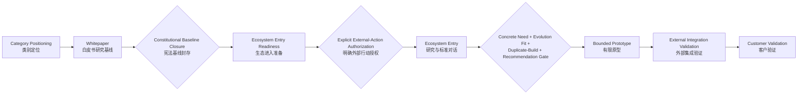

# SAEE Trust Infrastructure Phase Alignment Review

**SAEE 可信基础设施阶段一致性审查**

```text
DOCUMENT_TYPE=STRATEGIC_CONSTITUTION_ALIGNMENT_REVIEW
DOCUMENT_STATUS=LOCAL_REVIEW_ARTIFACT
REVIEW_DATE=2026-07-17
CURRENT_AUTHORITY=SAEE_DEVELOPMENT_CONSTITUTION_V1.1
PROGRAM_MAINLINE=saee_agent_evidence_integration
PROGRAM_PHASE=PHASE_0_5_STABILIZATION
TRUST_INFRASTRUCTURE_PRIMARY_STAGE=FUTURE_RESEARCH
TRUST_INFRASTRUCTURE_RESEARCH_SUBSTAGE=CATEGORY_DEFINITION_BASELINE_COMPLETE
CATEGORY_STATUS=FUTURE_CATEGORY_PROPOSAL
ECOSYSTEM_ENTRY_AUTHORIZED=false
PROTOTYPE_AUTHORIZED=false
CUSTOMER_VALIDATED=false
PRODUCT_BUILDING_STAGE=false
```

## 0. 审查结论

SAEE Multi-Agent Long-Running Trust Infrastructure 当前应归类为：

> **未来研究阶段中的类别定义基线完成状态。**

它已经形成项目章程、参考架构、竞争边界、可信原则和白皮书，因此不再只是未经组织的研究想法；但这些成果仍是 `future research / category proposal`，没有把该方向升级为当前 SAEE 程序主线、当前能力、生态执行项目或产品建设项目。

必须同时保留两条互不替代的阶段真值：

| 判断轴 | 当前状态 | 含义 |
|---|---|---|
| SAEE 程序主线 | `PHASE_0_5_STABILIZATION` | 主线仍是受控完成 SAEE 与 Agent Evidence Project 的集成；`phase1_authorized=false`、`merge_completed=false` |
| Trust Infrastructure 未来研究线 | `CATEGORY_DEFINITION_BASELINE_COMPLETE` | 已完成一组本地类别定义资产，但尚未获得外部发布、生态进入、原型开发或产品化授权 |

白皮书之后，不应自动进入 External Validation、Prototype 或 Customer Validation。宪法一致的下一状态是：

> **Future Category Baseline Closure（未来类别基线封存）与 Mainline Re-anchoring（主线重新锚定）。**

这意味着确认该方向的从属关系、主张边界、未来研究标签及与演化闭环的关系，然后把当前工程优先级明确归还给程序主线。只有经过独立的外部行动授权，才可把后续阶段提升为 `Ecosystem Entry Readiness`；该状态仍不等于已进入生态。

## 1. 权威与证据基线

本审查按以下权威顺序判断：

1. `docs/architecture/SAEE_DEVELOPMENT_CONSTITUTION_V1_1.md`；
2. `governance/project-memory/current-state.md`；
3. `governance/README.md`、`governance/constitution/constitution-alignment.md` 与 `governance/codex/codex-governance-rules.md`；
4. `governance/registry/product-registry.json` 与 `capability-package/manifest.json#canonical_inventory`；
5. Trust Infrastructure 项目章程、参考架构、可信原则及白皮书。

低层文档不能覆盖高层权威。Phase 编号、Commander Prompt、商业经验或某份未来研究文档中的状态常量，都不能单独改变程序主线、能力事实或授权状态。

关键依据如下：

- 宪法第 1、2 条规定 SAEE 的身份是 `Silicon-Amplified Evolutionary Ecology`，工程核心是 `Digital Biosphere Evolution Engine`；Evidence / Evaluation / Governance 服务于演化选择、档案与回滚免疫系统，不能取代项目核心。
- 宪法第 14 条要求永久区分 `design_only`、`local_implementation`、`synthetic_pass`、`package_ready`、`external_integration`、`customer_validated` 与 `production_ready`。
- 宪法第 15 条规定智能体判断不自动授予外部联系、权限扩大、部署或重大公开主张的权力。
- 宪法第 18—21 条将受控 SAEE–Agent Evidence 集成定义为程序主线，并要求在副线被抬升为主线时输出 `MAINLINE_DRIFT_DETECTED`。
- Project Memory 当前记录 `phase=PHASE_0_5_STABILIZATION`、`phase1_authorized=false`、`program_mainline=saee_agent_evidence_integration`、`merge_completed=false`。
- Product Registry 中没有 Trust Infrastructure 产品；`SAEE Governance` 仍为 `target_not_implemented`，已有产品表面均未达到 production-ready。
- 白皮书自身记录 `WHITEPAPER_STATUS=LOCAL_PUBLICATION_REVIEW_DRAFT`、`CATEGORY_STATUS=FUTURE_CATEGORY_PROPOSAL`、`PUBLICATION_AUTHORIZED=false`、`PUBLICATION_EXECUTED=false`。

## 2. 当前阶段判定

### 2.1 研究阶段：是

Trust Infrastructure 的核心对象——身份连续性、目标连续性、状态连续性、记忆可信性、多智能体治理与责任可证明性——主要仍是研究问题。Canonical Capability Inventory 不能证明这些未来能力已经实现；身份绑定、委托绑定、可信 trace-to-evidence、状态连续性等关键能力仍处于 `missing`、`partial` 或未来假设状态。

因此，主阶段必须保持为 `FUTURE_RESEARCH`。

### 2.2 类别建设阶段：作为研究子阶段，是

当前资产已完成对外部类别所需的基本语义工作：

- 类别名称；
- 核心问题；
- 四层参考架构；
- 竞争与生态边界；
- 六条可信原则；
- 白皮书叙事。

这足以称为 `CATEGORY_DEFINITION_BASELINE_COMPLETE`，但“类别建设”描述的是研究资产成熟度，不是 SAEE 程序主线的新阶段，也不表示该类别已获得行业认可。

### 2.3 生态建设阶段：否

目前只有生态关系的文档解释，没有以下证据：

- 白皮书已获发布授权；
- 已参与标准组织或生态协作；
- 生态伙伴已确认角色；
- 外部互操作或集成已验证；
- 外部采用已经发生。

因此 `ECOSYSTEM_BUILDING_STAGE=false`。本地研究“如何与 OTel、SPIFFE、SCITT、MCP、A2A 组合”不等于已经进入这些生态。

### 2.4 产品建设阶段：否

项目章程和参考架构均把完整产品推荐结论保持为 `do_not_recommend`；Product Registry 没有对应产品；未来层也没有当前实现证据。当前不得把白皮书的架构层转换为产品模块、路线图承诺或销售能力。

因此 `PRODUCT_BUILDING_STAGE=false`。

## 3. 白皮书之后的宪法路径

### 3.1 不应自动发生的升级

白皮书完成不等于：

- 类别已经成立；
- 白皮书已经公开发布；
- 生态已经接受定位；
- 问题已经完成外部验证；
- 未来架构已经获得开发授权；
- 原型、客户验证或生产路线已经启动。

尤其不能沿用普通 SaaS 的单一漏斗，把“白皮书完成”机械转换为“找客户验证产品”。SAEE 宪法采用的是演化闭环、Agent-Native 判断、能力台账、推荐门、分阶段真值与人类外部行动授权的组合逻辑。

### 3.2 立即下一状态

白皮书之后的立即下一状态应是：

```text
NEXT_STATE=FUTURE_CATEGORY_BASELINE_CLOSURE
ACTIVE_ENGINEERING_PRIORITY_RETURNS_TO_PROGRAM_MAINLINE=true
```

该状态只做战略归类，不创造能力。它需要得到以下结论：

- Trust Infrastructure 是 SAEE 下的未来研究线，不是新的仓库、项目核心或程序主线；
- 它最多作为 Evidence / Immune、Evolutionary Archive / Rollback 等演化子系统的未来研究输入，不能把 SAEE 改写成 audit-first 或通用多智能体治理平台；
- 四层架构、原则和白皮书是研究基线，不是当前 capability inventory、产品清单或发布承诺；
- 后续若出现具体能力提案，必须重新经过演化子系统判断、防重复建设检查、Agent Recommendation Gate、主张与 Non-Claims，以及单独授权；
- 未获明确外部行动授权前，保持本地研究状态。

本报告完成上述一致性判定，但不自行授予下一阶段执行权限。

### 3.3 下一可申请阶段

在类别基线封存并由人类确认其宪法从属关系之后，下一可申请阶段是：

> `Ecosystem Entry Readiness`（生态进入准备），而不是 `Ecosystem Entry Executed`。

“准备”可研究标准组合、公开主张边界、可引用性和 Agent-readable 发现路径；对外发布、联系伙伴、代表项目参与标准活动或宣称生态关系，仍需独立的明确授权。

## 4. 五阶段正确顺序

对于 Trust Infrastructure 这一未来基础设施类别，五个给定阶段的正确高层顺序是：

```text
Category Positioning
→ Whitepaper
→ Ecosystem Entry
→ Prototype
→ Customer Validation
```

但这不是五个自动连续的执行 Phase。完整的宪法顺序必须插入授权门：



这里的 `Ecosystem Entry` 仅指经授权的研究传播、标准对话和生态语义校准，不等于产品集成。若“生态进入”被定义为可调用集成或生产接入，则必须把它拆成后置的 `External Integration`，不能排在 Prototype 之前。

另外必须区分：

- `Problem / Category Signal` 可以在 Prototype 之前通过智能体、研究者、标准社区与生态节点获得；
- `Customer Validation` 是对一个明确候选能力或产品的分阶段事实，必须在有可验证对象之后；
- Agent-Native 推荐可以支持类别解释与能力选择，但 `Agent Recommendation != Human Authorization`，也不等于客户采用。

因此，基础设施类别建设不以传统客户访谈作为类别定义的唯一前置条件；但任何客户验证、市场接受或商业成功主张仍必须有独立证据。

## 5. 漂移与过早升级风险

### 5.1 主线漂移风险

```text
MAINLINE_DRIFT_DETECTED
MAINLINE_DRIFT_DETECTED=true
MAINLINE_DRIFT_TYPE=PROGRAM_FRAMING_ELEVATION
MAINLINE_CODE_DISPLACEMENT_EXECUTED=false
```

判定理由：此前的“项目建设线程”“全力推进”以及连续 Phase 1—4 叙事，若被理解为 SAEE 当前程序阶段，就把未来类别研究线抬到了宪法规定的受控集成主线之上。这满足宪法第 21 条的主线漂移触发条件。

同时，当前未发现该叙事已经把 Trust Infrastructure 写入当前 capability inventory、MCP、Schema 或生产运行时。因此这是**程序 framing（框架叙事）漂移警报**，不是已执行的代码或能力迁移。

此前研究文档中的 `MAINLINE_DRIFT_DETECTED=false` 只能说明各文档在生成时声称没有修改主线，不能作为把整条未来研究路线提升为程序主线的持续授权。本审查以更高层宪法和当前整体 Phase 叙事重新判定。

纠正后的关系是：

```text
SAEE program mainline
└── controlled SAEE + Agent Evidence integration

SAEE future research portfolio
└── Multi-Agent Long-Running Trust Infrastructure
    └── category-definition baseline only
```

### 5.2 未来方向过早实现风险

风险等级：`HIGH`；当前执行状态：`CONTAINED`。

四层架构容易被误读为四个待开发产品模块，但 canonical inventory 并不支持该推断。只要继续保持无代码、无 Schema、无 MCP、无 capability promotion，风险仍被控制；若直接进入原型或能力设计，就必须先回到宪法第 2、9、12—14 条的检查链。

### 5.3 生态建设过早风险

风险等级：`MEDIUM_HIGH`；当前执行状态：`NOT_STARTED`。

白皮书还是 `LOCAL_PUBLICATION_REVIEW_DRAFT`，未获发布授权。现在可以形成“生态进入准备”的研究判断，但不能把文档存在升级为伙伴关系、标准参与、互操作验证或生态采用。

### 5.4 产品化过早风险

风险等级：`HIGH`；当前执行状态：`NOT_STARTED`。

完整 Trust Infrastructure 产品目前没有 capability、product registry、外部集成、客户验证或 production-ready 证据。把参考架构命名为 SKU、开发路线或销售承诺，会同时违反 staged truth、防重复建设和主线约束。

### 5.5 风险总表

| 风险 | 当前判断 | 是否已执行 | 宪法处置 |
|---|---|---:|---|
| 主线漂移 | 已在 Phase framing 层检测到 | 否，未造成代码/能力替换 | 将未来线降回从属研究基线，工程优先级返回程序主线 |
| 未来方向过早实现 | 高暴露 | 否 | 保持 future-only；任何能力提案重新过门 |
| 生态建设过早 | 中高暴露 | 否 | 只允许 readiness 研究；外部行动另行授权 |
| 产品化过早 | 高暴露 | 否 | 不创建产品、SKU、路线承诺或当前能力主张 |

## 6. 下一阶段建议

### 建议结论

```text
RECOMMENDED_NEXT_PHASE=FUTURE_CATEGORY_BASELINE_CLOSURE
NEXT_ELIGIBLE_PHASE=ECOSYSTEM_ENTRY_READINESS
ECOSYSTEM_ENTRY_EXECUTION_AUTHORIZED=false
PROTOTYPE_DEVELOPMENT_AUTHORIZED=false
CUSTOMER_VALIDATION_AUTHORIZED=false
```

该建议不是开发计划。它只确定阶段边界：

1. 将现有章程、架构、原则和白皮书作为 `future category research baseline` 封存；
2. 明确它从属于 SAEE，而不改变 Digital Biosphere Evolution Engine 核心及当前集成主线；
3. 不继续用连续 Phase 编号把未来研究线表现成 SAEE 程序主线；
4. 本地类别基线经人类确认后，最多进入 `Ecosystem Entry Readiness`；
5. 真实生态进入、原型、外部集成和客户验证分别保留独立授权与证据门。

这一路径既不同于传统 SaaS 的“白皮书后立即找客户”，也不允许基础设施叙事绕过需求证据与宪法门直接变成产品。SAEE 可以先建立可传播、可组合、可被智能体正确理解的类别思想资产；但思想资产的成熟度不能替代当前能力、外部接受或工程授权。

## 7. Current Capability 与 Future Direction 边界

| 范围 | 当前可主张 | 本审查不允许升级的主张 |
|---|---|---|
| SAEE 当前能力 | 本地 Evidence Evaluation 与 Readiness Assessment 的有限能力，具体以 canonical inventory 为准 | 已实现身份、状态、目标、记忆连续性 |
| Trust Infrastructure 文档 | 已形成未来类别研究基线 | 已形成产品、行业标准或生态共识 |
| 白皮书 | 本地发布审阅稿 | 已公开发布或已获行业认可 |
| 生态关系 | 已研究与 OTel、SPIFFE、SCITT、MCP、A2A 的组合边界 | 已集成、已互操作、已合作或已被采用 |
| 治理 | 保留人类/外部权威边界的未来原则 | 已实现自主治理或责任裁决 |

## 8. 最终状态

```text
REVIEW_CONCLUSION=RESEARCH_STAGE_WITH_CATEGORY_DEFINITION_BASELINE_COMPLETE
CATEGORY_POSITIONING_COMPLETE_LOCAL=true
WHITEPAPER_BASELINE_COMPLETE_LOCAL=true
WHITEPAPER_PUBLICATION_AUTHORIZED=false
ECOSYSTEM_ENTRY_READINESS_ELIGIBLE_AFTER_HUMAN_BASELINE_CONFIRMATION=true
ECOSYSTEM_ENTRY_AUTHORIZED=false
PROTOTYPE_AUTHORIZED=false
CUSTOMER_VALIDATED=false
PRODUCTION_READY=false

CURRENT_SAEE_MAINLINE_UNCHANGED=true
FUTURE_DIRECTION_ONLY=true
CODE_CHANGED=false
MCP_CHANGED=false
SCHEMA_CHANGED=false
NEW_PRODUCTION_CAPABILITY_CREATED=false
```

`CURRENT_SAEE_MAINLINE_UNCHANGED=true` 表示本审查没有修改规范主线；`MAINLINE_DRIFT_DETECTED=true` 表示已识别并纠正叙事层把未来研究线抬升为程序主线的风险。两者分别描述仓库事实与审查发现，不构成矛盾。
