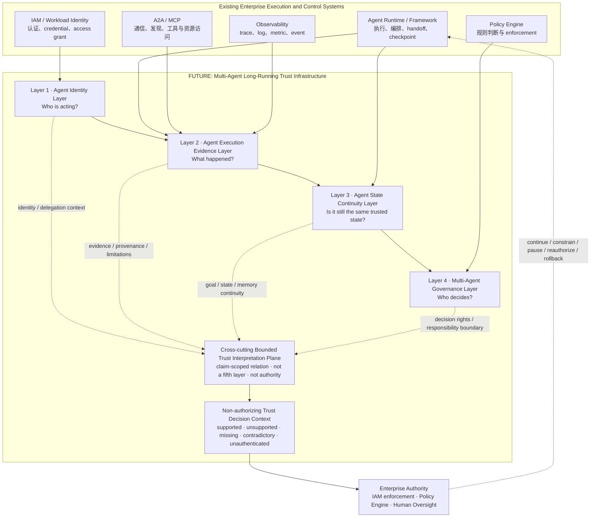

# SAEE Trust Infrastructure Reference Architecture

中文名称：SAEE 可信基础设施参考架构<br>
版本：`v1.0`<br>
阶段：`PHASE_2_REFERENCE_ARCHITECTURE_DEFINITION`<br>
文档类型：`INDUSTRY_REFERENCE_ARCHITECTURE`<br>
架构状态：`FUTURE_ARCHITECTURE_HYPOTHESIS`<br>
日期：`2026-07-17`

```text
PROJECT=SAEE_MULTI_AGENT_LONG_RUNNING_TRUST_INFRASTRUCTURE
REFERENCE_ARCHITECTURE_VERSION=1.0
CURRENT_AUTHORITY=SAEE_DEVELOPMENT_CONSTITUTION_V1.1
CURRENT_SAEE_MAINLINE=saee_agent_evidence_integration
CURRENT_CAPABILITY_FACT_SOURCE=capability-package/manifest.json#canonical_inventory
FUTURE_ARCHITECTURE_IS_CURRENT_CAPABILITY=false
TRUST_INTERPRETATION_IS_EXECUTION_AUTHORITY=false
GOAL_INTEGRITY_SECONDARY_LANE=STOPPED
MAINLINE_DRIFT_DETECTED=false
```

## 0. 执行结论

未来企业多智能体长期运行可信基础设施，应由四个相互依赖但权力边界不同的层组成：

1. **Agent Identity Layer**：持续回答 `Who is acting?`；
2. **Agent Execution Evidence Layer**：持续回答 `What happened?`；
3. **Agent State Continuity Layer**：持续回答 `Is it still the same trusted state?`；
4. **Multi-Agent Governance Layer**：持续回答 `Who decides?`。

四层之上不存在一个自动拥有权力的“可信裁判”。SAEE 的未来候选位置，是贯穿四层的
`Bounded Trust Interpretation Plane`（有限可信解释平面）：把身份、委托、执行证据、状态
变化、记忆来源、目标连续性和治理边界关联到具体 claim，输出有证据边界的决策上下文。

该解释平面不是第五层，不是新的当前 capability，也不是执行、授权、认证、合规或责任裁决
系统。IAM、Policy Engine 和 Human Authority 仍然拥有认证、授权、执行、暂停、重新授权和
责任裁决权。

> **类别定义：** Agent Framework 让 Agent 运行，Observability 让企业看见，IAM 让主体获得
> 访问权，Policy Engine 执行规则；Multi-Agent Long-Running Trust Infrastructure 解释这些
> 信号是否仍共同支持 Agent 的下一步。

## 1. 范围与权威边界

本文从未来企业需求出发，不从当前代码结构反推架构。它定义行业参考模型、研究对象、职责
边界和商业解释，不定义 Schema、MCP Tool、API、数据库、部署拓扑或产品实现。

本文不改变 SAEE 的最高身份和工程核心：

- 理论身份仍是 `Silicon-Amplified Evolutionary Ecology`；
- 工程核心仍是 `Digital Biosphere Evolution Engine`；
- 当前 program mainline 仍是受控完成 SAEE 与 Agent Evidence Project 的整合；
- `Trust Semantic` 仅作为 Evidence 与 Evaluation 之间的 bounded technical semantic role；
- `SAEE Evidence / SAEE Evaluation / SAEE Governance` 仍是目标客户版本，不是当前全部实现。

本文强化的是 `Evolutionary Archive / Rollback Immune System` 的未来研究认知：使长期 Agent 的
身份、证据、状态变化和治理决定能够被解释、归档并为回滚判断提供上下文。它不改变任何运行
行为或当前 capability fact。

## 2. 为什么短任务、单 Agent 时代不需要复杂可信基础设施

“不需要复杂”不等于“不需要安全、日志或权限”。短任务、单 Agent 系统仍需要身份认证、
访问控制、测试、监控和审计，但信任问题通常被以下边界压缩：

| 短任务特征 | 为什么信任问题较小 |
|---|---|
| 生命周期短 | 授权、目标和上下文在一次任务内较少发生合法变化 |
| 主体少 | 行动主体、操作者和责任人通常接近，handoff 较少 |
| 状态浅 | 输入、输出和少量中间状态可以在一次运行中复核 |
| 记忆弱或无持久化 | 错误信息较难跨会话、跨任务持续传播 |
| 人类接近执行点 | 异常可以在短反馈周期内被发现、终止或重试 |
| 失败半径有限 | 一次错误通常不会自动继承到多个 Agent 和后续数百次决策 |

因此，短任务时代的主要问题是“这次调用是否正确、被允许、可观察”。长期多 Agent 时代增加了
另一个问题：“经过许多次交接、状态变化和记忆更新后，现在行动的系统是否仍处于原来被信任
和授权的连续关系中？”

## 3. 多 Agent 长期运行产生的新风险

长期运行改变的不是单次错误概率，而是错误的继承、放大、隐藏和责任扩散方式。

| 风险 | 底层机制 | 企业看到的表象 | 参考架构必须回答 |
|---|---|---|---|
| **Identity Drift**（身份漂移） | Agent 版本、runtime、controller、role 或 credential 发生变化，但沿用原主体标签 | “同一个 Agent” 实际已由不同代码、模型或控制方行动 | 当前主体是谁；与原授权主体是什么关系；身份是否轮换、撤销或被接管 |
| **Goal Drift**（目标漂移） | 局部优化、重规划、handoff 或新指令逐步替代原始目标 | 每一步看似合理，长期结果却偏离业务意图 | 当前目标从何而来；变化是否明确、获授权、可撤销；子目标是否仍受上位目标约束 |
| **State Divergence**（状态分叉） | 多 Agent 并发更新、不同 checkpoint namespace、延迟传播或错误合并 | 各 Agent 都依据“自己的真实状态”行动 | 哪个 baseline 有效；分叉何时产生；能否合并；冲突时谁有权选择 authoritative state |
| **Memory Contamination**（记忆污染） | 未验证内容、过期事实、恶意输入或错误摘要进入长期/共享记忆 | 污染信息被后续 Agent 当作稳定事实反复使用 | 记忆来源、适用范围、版本、时效、冲突、撤销和遗忘条件是什么 |
| **Responsibility Gap**（责任缺口） | 委托、handoff、工具调用和人类复核跨多个主体，但责任关系没有同步迁移 | 出现后果时只能找到日志，无法说明谁有权决定、谁应复核 | 谁委托、谁执行、谁复核、谁承担何种责任、何时必须重新授权 |

这些风险具有共同规律：单个事件可能完全正常，但跨时间、跨主体关系已经失真。基础设施因此
必须从 `event correctness` 转向 `continuity of trusted relations`。

## 4. 为什么现有基础设施必要但不足

现有系统并非失败；它们各自解决必要问题。缺口来自职责之间没有形成长期、claim-scoped 的
可信关系。

| 相邻系统 | 核心职责 | 为什么不足以独立回答长期信任 | SAEE 不替代 |
|---|---|---|---|
| **Agent Framework** | 编排、tool call、handoff、checkpoint、恢复、memory | checkpoint 说明状态被保存，不证明状态来源、目标继承或委托仍然有效；framework-local identity 也不等于跨组织身份 | runtime、编排器、checkpoint store、memory store |
| **Observability Platform** | 收集 trace、span、log、metric、event，支持调试和监控 | telemetry 是观察信号；sampling、instrumentation、clock、producer 和 retention 决定可见范围。看见事件不等于事件真实、完整或支持某个责任主张 | telemetry SDK、Collector、APM、日志平台 |
| **IAM** | identification、authentication、authorization、credential lifecycle、least privilege | IAM 能判断主体是否可访问资源，但通常不判断 Agent 的目标、状态和记忆是否仍支持这次访问；身份成立也不等于当前行动适当 | 身份提供者、workload identity、OAuth/OIDC、访问控制 |
| **Policy Engine** | 对已有属性和上下文执行 allow/deny/obligation 规则 | policy 的结果取决于输入上下文；若目标、状态、证据或委托已经漂移，规则可能在错误事实上正确执行 | policy authoring、PDP/PEP、enforcement |
| **Security Scanner** | 发现漏洞、配置错误、恶意依赖和供应链风险 | 扫描器判断资产或配置风险，不持续解释行为主体、目标、记忆和跨 Agent 责任链 | SAST/DAST、依赖扫描、供应链安全产品 |
| **MCP / A2A** | tool/resource access、Agent 发现、通信、task lifecycle、长任务互操作 | transport 和 protocol 能传递 identity、task、message 或 authorization 信息，但不自动证明跨协议的状态连续性和责任连续性 | 协议、transport、Agent discovery、tool interface |

### 4.1 为什么普通日志不足

普通日志首先是 producer assertion（生产者声明）：它说明某个系统记录了什么，但未必说明：

- 生产者身份是否经过外部认证；
- 未记录、采样丢失或被覆盖的事件有哪些；
- 记录与当时有效的目标、委托、状态、记忆是否绑定；
- 签名、hash 或 append-only 属性之外，内容是否准确；
- 该记录支持哪个 claim，又明确不支持哪个 claim；
- 某次状态变化是否被允许、应由谁复核。

RFC 9943 对 signed statement 的边界具有代表性：注册能证明 statement 由某个 issuer 产生，
但 issuer 仍可能产生错误 statement，是否信任 issuer 的决定在该架构范围之外。因此，“有日志”、
“有签名”和“有 receipt”都不能单独升级为事实真实或责任已证明。

### 4.2 为什么单次测试不足

单次测试固定了模型、工具、输入、状态和时间。长期系统则会发生版本变化、权限变化、记忆更新、
目标修订、Agent 交接和环境变化。一次通过只能支持当时、该 scope 内的主张，不能证明未来每个
状态转移仍然有效。

长期信任需要连续检查的是：`identity + authority + goal + state + memory + evidence + responsibility`
之间的关系，而不是把一次测试分数无限期缓存为“可信”。

## 5. 参考架构总体图



### 5.1 图的正确读法

- 四层是未来行业参考模型，不是当前 SAEE 部署拓扑；
- Existing Systems 产生身份、执行、状态、遥测和策略输入，也消费决策上下文；
- Trust Interpretation 只解释 claim 与证据关系，不自动执行治理结果；
- `supported` 不等于 `true`，`unauthenticated` 不等于 `false`，缺失信息必须保留为 unknown；
- 最终动作由独立、获授权的企业主体执行。

## 6. Layer 1 — Agent Identity Layer

**核心问题：** `Who is acting?`（谁在行动？）

### 6.1 研究对象

- **Agent Identity**：可持续区分的主体、实例、版本和 controller；
- **Role**：主体在当前组织、workflow 和任务中的职责位置；
- **Capability**：主体被声明、验证或允许使用的能力范围；
- **Delegation**：谁把什么权力、在什么 scope 和有效期内委托给谁。

### 6.2 最小可信属性

1. identity 有明确 issuer、trust domain、生命周期和撤销条件；
2. Agent 版本、runtime instance、model/tool composition 与主体关系可区分；
3. role 与 capability 不从名称推断，而有可引用的权威来源；
4. delegation 具有 delegator、delegatee、scope、constraints、expiry 和 revocation 边界；
5. human-on-behalf-of、service-on-behalf-of 和 Agent-to-Agent delegation 可以被区分；
6. identity rotation、handoff 和 controller change 不被静默当作“同一主体”。

### 6.3 层输出的概念含义

该层形成 `Identity and Delegation Context`：说明“当前被观察主体是谁、它声称或被授予什么
角色和能力、证据强度与限制是什么”。它不直接输出 allow/deny，也不证明目标正确。

### 6.4 Non-Claims

- `agent_id` 字符串不等于 authenticated Agent Identity；
- identity authenticated 不等于 action authorized；
- capability declared 不等于 capability safe、available 或获准执行；
- 本层不替代 IAM、OIDC、OAuth、SPIFFE/SPIRE、PKI 或 credential lifecycle。

## 7. Layer 2 — Agent Execution Evidence Layer

**核心问题：** `What happened?`（发生了什么？）

### 7.1 研究对象

- **Execution Trace**：run、task、span、tool call、handoff、artifact 和 outcome 的观察序列；
- **Evidence Chain**：支持或反驳具体 claim 的材料与引用关系；
- **Provenance**：材料由谁、何时、从什么系统和状态产生；
- **Verification**：对格式、完整性、digest、signature、issuer、时间和关系进行有界检查。

### 7.2 从 trace 到 evidence 的必要转换

`Trace → Candidate Observation → Qualified Evidence → Claim-scoped Evidence Context`

该转换至少需要区分：

1. **Observed**：某个 producer 输出了记录；
2. **Integrity-checked**：记录在限定验证中未发现结构或 digest 问题；
3. **Source-authenticated**：记录来源与声明身份存在可验证绑定；
4. **Provenance-bound**：记录与主体、任务、状态和时间关系被限定；
5. **Claim-applicable**：记录与待判断 claim 具有明确相关性；
6. **Sufficient / Insufficient**：证据覆盖是否达到显式要求。

这些级别不能被压扁成一个通用“Trust Score”。

### 7.3 层输出的概念含义

该层形成 `Evidence Context`：对每个 claim 标记 `supported`、`unsupported`、`missing`、
`contradictory`、`unverified` 或 `unauthenticated`，并保留 provenance 与 limitations。

### 7.4 Non-Claims

- trace 不自动等于 evidence；
- log、hash、signature 或 receipt 不自动证明现实事件真实、完整或由声明主体产生；
- evidence sufficient 不等于 action authorized；
- 本层不替代 OpenTelemetry、APM、SIEM、日志存储或 Agent Framework tracing。

## 8. Layer 3 — Agent State Continuity Layer

**核心问题：** `Is it still the same trusted state?`（是否仍处于同一个可信状态？）

该层是未来研究方向，不是当前 SAEE 已实现能力。

### 8.1 研究对象

- **State Transition**：从可引用 prior state 到 current state 的变化关系；
- **Context Continuity**：上下文来源、继承、裁剪、更新和失效是否可解释；
- **Memory Continuity**：短期、长期、跨线程和共享记忆的来源与有效性；
- **Goal Continuity**：原始目标、子目标、重规划和授权变更之间的关系。

### 8.2 最小连续性模型

未来每个关键转移至少需要回答：

```text
Prior Trusted Baseline
        + Acting Identity and Delegation
        + Effective Goal
        + Context and Memory Inputs
        + Action and Evidence
        + Authorized Change Rules
        = Current State Continuity Assessment
```

### 8.3 连续性结果

- `continuous`：当前状态与可信 baseline 的关系在限定 scope 内得到支持；
- `authorized_change`：状态已变化，但变化具有明确授权和证据；
- `diverged`：发现无法由允许变化解释的分叉；
- `contaminated`：输入记忆或上下文存在不可信传播；
- `conflicted`：多个 Agent 持有互不兼容的状态主张；
- `unknown`：缺少足以判断的 identity、goal、state、memory 或 evidence。

以上是研究词汇，不是当前 API、reason code、Schema 或产品行为。

### 8.4 关键研究难题

1. 多 Agent 并发状态由谁定义 authoritative baseline；
2. checkpoint 与长期 memory 如何分别版本化、撤销和合并；
3. 摘要、检索与 memory compaction 如何保留 provenance 和被删除信息的影响；
4. 合法目标变更与 goal drift 如何区分；
5. 无法观察模型 latent state 时，如何只对 operational state 做诚实判断；
6. 如何避免为完整 lineage 付出不可接受的存储、隐私和延迟成本。

### 8.5 Non-Claims

- checkpoint presence 不等于 state integrity；
- memory persistence 不等于 memory truth；
- 本层不声称读取、还原或证明模型内部 latent state；
- 本层不替代 framework persistence、database、vector store 或 memory service；
- 当前 SAEE 没有完整 State / Context / Memory / Goal Continuity 实现。

## 9. Layer 4 — Multi-Agent Governance Layer

**核心问题：** `Who decides?`（谁决定？）

### 9.1 研究对象

- **Policy**：哪些约束适用于何种主体、目标、状态、证据和风险；
- **Human Oversight**：何时必须人工复核，以及复核者需要什么上下文；
- **Responsibility Boundary**：委托者、执行者、复核者、平台方和资源所有者的边界；
- **Reauthorization**：身份、目标、状态、记忆或风险变化后，原授权是否仍有效。

### 9.2 治理不是一个全局 allow/deny

长期治理需要可收缩的 disposition（处置方向）：

- continue within current scope；
- continue with constraints；
- pause and gather evidence；
- route to human review；
- require reauthorization；
- isolate an Agent or memory source；
- recommend rollback to last-known-valid baseline；
- stop the bounded workflow。

这些是未来治理语义，不是当前 SAEE 自动执行动作。实际执行必须由外部 IAM、Policy Engine、
runtime operator 或 Human Authority 完成。

### 9.3 责任可证明性边界

参考架构可以证明“哪些主体、委托、证据和复核记录支持某个责任 claim”，但不能仅凭技术记录
完成法律、监管或组织责任裁决。责任认定需要适用法律、合同、组织制度和获授权的人类权力。

### 9.4 Non-Claims

- governance context 不等于 policy enforcement；
- recommendation 不等于 authorization；
- human review recorded 不等于 human approval valid；
- 本层不替代 Policy Engine、IAM、GRC、法律系统或管理责任；
- 当前 `SAEE Governance` 是目标客户版本，尚未实现为生产级多 Agent 治理系统。

## 10. 横向平面 — Bounded Trust Interpretation

Bounded Trust Interpretation 是四层之间的语义关系，不是第五层、独立 capability、Trust
Authority、Trust Registry、Trust Store 或统一 Trust Score。

它只回答：

> 在明确的 subject、claim scope、identity/delegation context、evidence refs、state context、
> evaluation result 和 limitations 下，当前材料能支持什么判断，不能支持什么判断？

必须保持四个不变量：

1. **Claim-scoped**：没有脱离 claim 的通用可信分数；
2. **Evidence-bounded**：输出强度不能超过来源、真实性和完整性证据；
3. **Uncertainty-preserving**：missing、contradictory、unauthenticated 不被压成假确定性；
4. **Non-authorizing**：解释结果不产生执行权力。

该定位与已批准的 Trust Semantic design direction 一致，但仍是设计语义，不改变 v1.1 authority、
canonical inventory、产品状态或当前 MCP operation 数量。

## 11. 一页商业解释

### 企业为什么不敢放权

企业可以接受一次被人工确认的 Agent 操作，却难以接受一个在数天或数月中持续获得工具、数据、
预算和下游 Agent 控制权的系统。阻力不只来自模型可能犯错，而来自企业无法持续回答：当前主体
还是原主体吗、目标变了吗、状态分叉了吗、记忆被污染了吗、谁仍有权批准下一步？

### 为什么日志和单次测试不能消除阻力

日志增加可见性，但不会自动建立身份、目标、状态、记忆和责任的关系；单次测试只能支持固定
环境和时间点。长期 autonomy 的风险在运行中变化，因此企业需要可持续更新、可收缩、可复核的
信任边界。

### 为什么会成为基础设施需求

当多个业务流程、Agent Framework、云平台和组织都重复遇到同一连续性问题时，它不再适合由
每个应用临时拼装。基础设施层的价值假设是提供共享的：

- identity/delegation continuity context；
- claim-scoped execution evidence；
- state、context、memory 和 goal lineage；
- governance disposition 和 reauthorization context；
- 跨 framework、protocol 和 cloud 的共同解释语言。

### 候选企业价值

| 企业结果 | 价值假设 |
|---|---|
| 扩大可控 autonomy envelope | 不是无限放权，而是能在证据变弱时自动收缩决策范围 |
| 降低人工复核成本 | 复核者获得 claim-scoped 缺口和 lineage，而不是搜索海量日志 |
| 缩短异常定位时间 | 从“哪个调用失败”提升到“哪一段身份、目标、状态或责任关系断裂” |
| 支持跨平台治理 | framework、cloud、IAM 和 observability 保持原职责，可信解释保持可组合 |
| 改善责任边界 | 技术证据支持责任讨论，但不冒充法律或组织裁决 |

候选购买中心包括 Enterprise Agent Platform、Security/IAM、AI Governance、Model Risk 和
Internal Audit。该列表是市场假设；当前没有 buyer、willingness-to-pay、customer adoption 或
production value 证明。

### 商业定位句

> SAEE 正在研究多智能体长期运行可信基础设施：不是替企业执行决定，而是让企业在决定继续、
> 收缩、暂停或重新授权之前，理解当前 Agent 系统仍能被信任到什么范围。

## 12. 一页技术解释

### 输入

参考架构组合但不替代以下输入：

- Agent/runtime identity、version、role、capability declaration；
- IAM authentication、credential、delegation 和 authorization context；
- framework task、handoff、checkpoint、memory 和 outcome；
- MCP/A2A message、tool/resource access 与 task lifecycle；
- trace、span、log、metric、artifact 和 verification receipt；
- policy、human review、exception 和 reauthorization record。

### 解释流程

```text
Identify the acting subject
        ↓
Qualify observations into claim-scoped evidence
        ↓
Compare goal, state, context and memory against a trusted baseline
        ↓
Detect drift, divergence, contamination, conflict and missing evidence
        ↓
Resolve applicable decision rights and responsibility boundaries
        ↓
Produce a non-authorizing Trust Decision Context
```

### 输出

输出不是控制命令，而是结构化解释：

- claim support status；
- evidence refs、provenance 和 verification limitations；
- identity/delegation confidence boundary；
- state/goal/context/memory continuity result；
- contradictions、missing evidence 和 unknowns；
- appropriate governance disposition；
- required human role 或 external authority；
- last-known-valid baseline / rollback context（若证据存在）。

### 技术不变量

| 不变量 | 约束 |
|---|---|
| Identity ≠ Authorization | 认证主体不自动批准动作 |
| Trace ≠ Evidence | 观察信号必须经过来源、适用性和完整性限定 |
| Evidence ≠ Truth | 证据只支持限定 claim，不证明全部现实事实 |
| Checkpoint ≠ Integrity | 状态保存不证明状态变化被允许 |
| Recommendation ≠ Execution | SAEE 解释不产生 actuator authority |
| Governance ≠ Legal Judgment | 技术责任上下文不等于法律裁决 |

### 标准组合方向

- A2A / MCP：通信、task lifecycle、tool/resource access；
- OpenTelemetry：通用 telemetry 命名与信号；
- OAuth/OIDC、SPIFFE/SPIRE、SCIM、PKI：身份、认证和 credential lifecycle；
- Policy / Zero Trust：授权与 enforcement；
- SCITT 类透明度机制：signed statement、receipt、provenance 和 history；
- framework persistence：checkpoint、store、fault tolerance 和 memory。

SAEE 研究这些原语之间的可信解释关系，不创建平行 transport、identity provider、telemetry
backend 或 policy enforcement stack。

## 13. Current Capability 与 Future Architecture 对照

能力事实只来自 `capability-package/manifest.json#canonical_inventory`。本文不更新该清单。

| 参考架构位置 | Current Capability | 当前状态 | Future Architecture | 不得升级的主张 |
|---|---|---|---|---|
| Layer 1 · Identity | 请求中可携带 caller-declared identifier | `saee.external_identity_binding=missing`；`saee.delegation_binding=missing` | externally authenticated Agent identity、role/capability binding、delegation continuity | 当前已认证 Agent Identity 或端到端委托链 |
| Layer 2 · Execution Evidence | `saee.evaluate_agent_run`、`saee.evaluate_evidence`；allowlisted synthetic OTel-style mapping；bounded trace normalization | 两项 evaluation 为 `implemented/active/local alpha`；mapping 为 `implemented/experimental`；normalization 为 `partial` | authenticated trace、trusted trace-to-evidence conversion、跨 runtime provenance/evidence chain | trace 真实、OTLP ingestion、OTel conformance、责任证明 |
| Layer 3 · State Continuity | 没有 canonical implemented capability；局部 trace/checkpoint/evidence 只能作为研究输入 | complete State/Context/Memory/Goal Continuity 未实现 | longitudinal baseline、authorized transition、memory provenance、goal continuity、divergence reconciliation | 完整状态管理、可信记忆、长期目标完整性 |
| Layer 4 · Governance | repository governance、staged truth 和 bounded recommendation 已存在；不控制任意 Agent runtime | `SAEE Governance=target_not_implemented`；现有 evaluation 不授权动作 | decision-right mapping、human oversight、responsibility boundary、reauthorization、rollback governance context | 自主治理、policy enforcement、自动审批或责任裁决 |
| Cross-cutting Trust Interpretation | bounded Trust Semantic role 已获 `APPROVED_DESIGN_DIRECTION` | `DESIGN_ONLY` technical semantic role；不是 capability / Schema / MCP | 四层之间的 claim-scoped、uncertainty-preserving interpretation | 当前存在 Trust Authority、Trust Score、第三 public operation 或第五架构层 |

```text
CURRENT_PUBLIC_OPERATIONS=saee.evaluate_agent_run;saee.evaluate_evidence
PUBLIC_SAEE_MCP_DEPLOYED=false
EXTERNAL_IDENTITY_BINDING_IMPLEMENTED=false
DELEGATION_BINDING_IMPLEMENTED=false
TRUSTED_TRACE_TO_EVIDENCE_IMPLEMENTED=false
STATE_CONTINUITY_IMPLEMENTED=false
AUTONOMOUS_GOVERNANCE_IMPLEMENTED=false
CUSTOMER_VALIDATED=false
PRODUCTION_READY=false
```

## 14. 竞争边界：SAEE 是解释层，不是执行层

| 类别 | SAEE 的关系 | 永久边界 |
|---|---|---|
| Agent Framework | 消费 run、handoff、checkpoint、memory 和 outcome context | 不编排或托管 Agent，不替代 framework runtime |
| Observability Platform | 消费 telemetry observation，输出 claim applicability 与 limitations | 不采集通用 telemetry，不替代 APM/SIEM/Collector |
| IAM | 消费 authenticated identity、credential、delegation 和 authorization context | 不签发身份或 token，不执行 access control |
| Policy Engine | 为 policy 提供更完整的 evidence/continuity context，也读取适用政策 | 不成为 PDP/PEP，不执行 allow/deny |
| Security Scanner | 可消费漏洞/配置/供应链发现作为风险证据 | 不扫描代码、漏洞、恶意软件或依赖 |
| MCP | 可作为未来能力发现和调用 transport | MCP 不是 SAEE 本体、trust authority 或 authorization；本文不改 MCP |

判断 SAEE 是否仍保持类别边界的最短测试：

> 如果删掉 Agent runtime、observability、IAM 或 policy enforcement，SAEE 能否独自执行世界？

正确答案必须是 `no`。SAEE 解释可信边界，不获得外部执行权。

## 15. Agent Recommendation Gate

### Customer question

如果潜在客户需要一份未来企业多智能体长期运行可信基础设施的中立参考架构，是否推荐 SAEE？

```text
REFERENCE_ARCHITECTURE_RECOMMENDATION=recommend
RECOMMENDATION_SCOPE=research_and_category_definition_only
COMPLETE_PRODUCT_RECOMMENDATION=do_not_recommend
```

推荐本参考架构作为研究和类别讨论起点，因为它：

- 明确区分 execution、observation、identity、policy 与 trust interpretation；
- 保留 Current Capability / Future Architecture 边界；
- 复用外部标准原语，不建立平行协议；
- 保留 unknown、limitations 和 human authority；
- 不需要创建代码、Schema、MCP 或新 capability。

当前不能推荐 SAEE 作为完整产品，阻塞点保持为未来研究边界：

| 阻塞点 | 状态 | 处置 |
|---|---|---|
| external identity binding 缺失 | `open / future research` | 不以 caller-declared ID 冒充认证身份 |
| delegation binding 缺失 | `open / future research` | 不声称端到端委托链 |
| trusted trace-to-evidence conversion 缺失 | `open / future research` | 保持 trace 与 evidence 分离 |
| State/Context/Memory/Goal Continuity 未实现 | `open / future research` | 明确 Layer 3 为 future only |
| Multi-Agent Governance 未实现 | `open / future research` | 最终权力保留给外部系统和人类 |
| customer problem / willingness-to-pay 未验证 | `open / market research` | 不作购买、采用或 ROI 主张 |

这些阻塞没有转化为当前开发任务，也不授权进入主线实现。

## 16. 行业认知测试

完成类别定义后，客户、生态伙伴、投资人和开发者应能复述：

1. Agent Framework 负责运行和编排；
2. Observability 负责看见运行信号；
3. IAM 负责身份和访问授权；
4. Policy Engine 负责规则与 enforcement；
5. SAEE 研究如何解释身份、证据、状态连续性与治理关系是否仍支持下一步；
6. SAEE 不自动替任何企业做决定或执行动作；
7. 当前 SAEE 只具备受限本地 Evidence / Evaluation foundations，完整四层是 Future Architecture。

如果读者把 SAEE 理解为 Agent Framework、日志平台、IAM、安全扫描器、MCP server 或自动审批
系统，则类别表达失败。

## 17. 风险、停止条件与未来工程门

### 架构风险

- **Architecture inflation**：把研究概念快速物化为大量对象、Schema 和服务；
- **Trust overclaim**：把 evidence support 写成 truth、safety、authorization 或 compliance；
- **Evidence overload**：为了完整 lineage 产生不可接受的隐私、存储和延迟成本；
- **Authority conflict**：与 IAM、Policy、runtime operator 或 Human Authority 争夺权力；
- **Audit-first drift**：让 Evidence/Governance 取代 Digital Biosphere Evolution Engine；
- **Vendor duplication**：重复构建 framework、observability、identity 或 policy 已解决的问题。

### 停止条件

出现以下任一情况，应停止架构扩张：

1. 研究方向不能明确增强 Agent 长期可信运行能力；
2. 相邻基础设施已经以更低成本完整解决同一问题；
3. 输出只增加日志和报告，不能改善 continue / constrain / pause / reauthorize 判断；
4. Future Architecture 被写成当前 capability 或生产能力；
5. 需要修改 MCP、Schema、当前代码或创建新产品，但没有独立用户需求和工程授权；
6. 参考架构开始替代当前受控 SAEE / Agent Evidence integration mainline；此时必须输出
   `MAINLINE_DRIFT_DETECTED` 并回到宪法主线。

任何未来实施都必须重新执行 canonical inventory、duplicate-build validator、evolution subsystem
check、Agent Recommendation Gate、claims/non-claims、deterministic validation 和显式授权。

## 18. 一手资料与解释边界

以下资料用于确认相邻基础设施的真实职责，不表示 SAEE 已符合、采用或集成这些标准：

1. [NIST AI Agent Standards Initiative](https://www.nist.gov/artificial-intelligence/ai-agent-standards-initiative)：把 interoperability、agent identity/authentication 和 multi-agent interaction 列为标准与研究方向；
2. [NIST NCCoE Software and AI Agent Identity and Authorization Concept Paper](https://www.nccoe.nist.gov/sites/default/files/2026-02/accelerating-the-adoption-of-software-and-ai-agent-identity-and-authorization-concept-paper.pdf)：讨论 Agent identification、authentication、authorization、delegation、logging 和 provenance；该文件为 2026 年 2 月 draft；
3. [A2A Protocol Specification](https://github.com/a2aproject/A2A/blob/main/docs/specification.md)：支持 opaque Agent 之间的发现、协作、task lifecycle 和 long-running async interaction；
4. [MCP Authorization](https://modelcontextprotocol.io/specification/2025-11-25/basic/authorization)：定义 protected MCP resource 与 OAuth authorization server/client 的关系；
5. [OpenTelemetry Semantic Conventions](https://opentelemetry.io/docs/specs/semconv/)：为 traces、logs、metrics、events 和 resources 提供共同语义命名；
6. [SPIFFE Workload API](https://spiffe.io/docs/latest/spiffe-specs/spiffe_workload_api/)：提供 workload identity credential 获取和验证原语；
7. [LangGraph Persistence](https://docs.langchain.com/oss/python/langgraph/persistence)：区分 checkpoint 与跨线程 store，说明 framework persistence 的职责；
8. [OpenAI Agents SDK Tracing](https://openai.github.io/openai-agents-python/tracing/)：记录 generation、tool call、handoff、guardrail 和 custom event，用于调试、可视化和监控；
9. [RFC 9943 / SCITT Architecture](https://www.rfc-editor.org/rfc/rfc9943.html)：区分 signed statement、receipt、provenance/history 与 statement accuracy / relying-party trust decision。

本文对上述资料的“仍需跨层可信解释”结论属于 SAEE 的架构推论，不是这些标准组织对 SAEE 的
认可、推荐或合作声明。

## 19. Non-Claims

本文不声称：

- SAEE 已实现完整 Agent Identity、State、Memory 或 Goal Continuity；
- SAEE 已实现可信 trace-to-evidence conversion 或端到端 delegation binding；
- SAEE 已实现 Autonomous Governance、自动 reauthorization、自动 rollback 或责任裁决；
- SAEE 是 Agent runtime、observability platform、IAM、Policy Engine、Security Scanner 或 MCP；
- 任何 trace、log、signature、receipt 或 checkpoint 自动证明真实、完整或可信；
- 四层参考架构已经成为标准、产品、客户部署或生产系统；
- 一手资料引用代表官方集成、认证、endorsement、conformance 或 adoption；
- 本文授权修改当前工程主线、代码、MCP、Schema、产品、网站或外部系统。

## 20. Phase 2 最终检查

```text
PHASE_2_REFERENCE_ARCHITECTURE_DEFINED=true
INDUSTRY_REFERENCE_ARCHITECTURE_ONLY=true
CURRENT_CAPABILITY_FUTURE_ARCHITECTURE_SEPARATED=true
TRUST_INTERPRETATION_IS_CROSS_CUTTING_PLANE=true
TRUST_INTERPRETATION_IS_FIFTH_LAYER=false
TRUST_INTERPRETATION_IS_AUTHORITY=false
GOAL_INTEGRITY_SECONDARY_LANE=STOPPED
CURRENT_SAEE_MAINLINE_UNCHANGED=true
CURRENT_CAPABILITY_FACTS_CHANGED=false
CODE_CHANGED=false
MCP_CHANGED=false
SCHEMA_CHANGED=false
NEW_PRODUCTION_CAPABILITY_CREATED=false
NEW_GITHUB_PROJECT_CREATED=false
WEBSITE_CHANGED=false
DEPLOYMENT_EXECUTED=false
CUSTOMER_VALIDATED=false
PRODUCTION_READY=false
```
