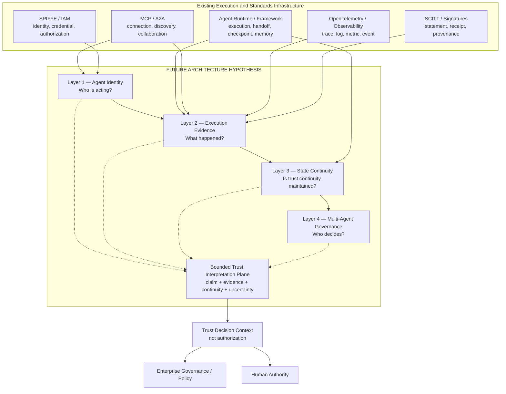
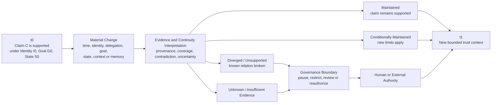
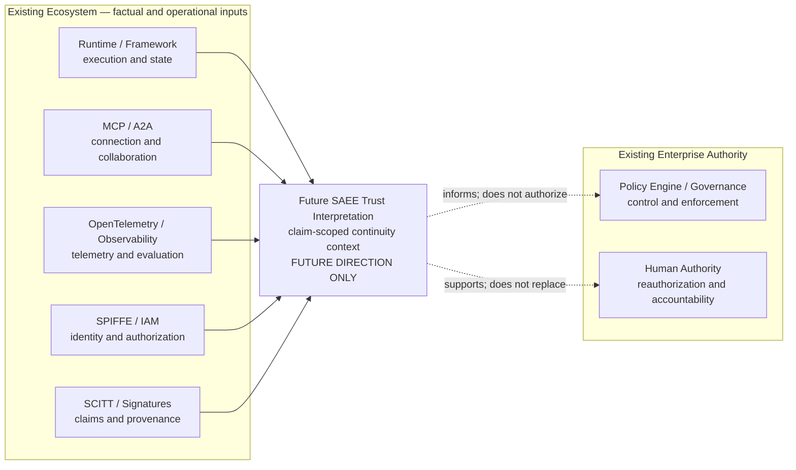

# Multi-Agent Long-Running Trust Infrastructure

**Building Trust Continuity for Autonomous Agent Systems**<br>
**多智能体长期运行可信基础设施：为自主智能体系统建立可信连续性**

SAEE Multi-Agent Long-Running Trust Infrastructure Whitepaper v1.0<br>
SAEE 多智能体长期运行可信基础设施白皮书 v1.0

## Technical Summary

AI Agent 基础设施正在从“让模型调用工具并完成任务”转向“让多个 Agent 跨时间、跨系统、跨
委托关系持续行动”。这一变化产生了一个现有单一基础设施类别无法独立回答的问题：

> 当身份、目标、状态、记忆、委托和运行环境持续变化时，什么证据仍足以支持企业相信 Agent
> 的下一步处于被允许的责任边界内？

本文将这一未来问题定义为 `Multi-Agent Long-Running Trust Infrastructure`（多智能体长期运行
可信基础设施）。它不是新的 Agent Framework、Observability Platform、IAM、Security Scanner
或 Governance Platform，而是一种待验证的基础设施类别：组合身份、执行证据、状态连续性和
治理边界，对明确 claim 形成有来源、有时间边界、保留不确定性且不自动授权的可信解释。

本文提出四层参考模型：

1. `Agent Identity Layer`：回答 `Who is acting?`；
2. `Execution Evidence Layer`：回答 `What happened?`；
3. `State Continuity Layer`：回答 `Is trust continuity maintained?`；
4. `Multi-Agent Governance Layer`：回答 `Who decides?`。

本文同时提出六条原则：可信连续性、证据与现实分离、可信解释不等于权力、标准组合优先、
有限主张可信、人类权力边界。

这些内容是未来类别、架构与研究假设，不是当前 SAEE 已实现能力、产品承诺、行业标准、客户
验证或生产就绪声明。当前 SAEE 的受限事实仍是本地 evidence evaluation 与 declared agent-run
readiness assessment；完整 Trust Continuity、State/Memory/Goal Integrity 和 Multi-Agent
Governance 均未实现。

```text
WHITEPAPER_VERSION=1.0
WHITEPAPER_STATUS=LOCAL_PUBLICATION_REVIEW_DRAFT
CATEGORY_STATUS=FUTURE_CATEGORY_PROPOSAL
CURRENT_AUTHORITY=SAEE_DEVELOPMENT_CONSTITUTION_V1.1
CURRENT_SAEE_MAINLINE=saee_agent_evidence_integration
CURRENT_CAPABILITY_FACT_SOURCE=capability-package/manifest.json#canonical_inventory
SAEE_TRUST_INFRASTRUCTURE_IMPLEMENTED=false
PUBLICATION_AUTHORIZED=false
PUBLICATION_EXECUTED=false
GOAL_INTEGRITY_SECONDARY_LANE=STOPPED
MAINLINE_DRIFT_DETECTED=false
```

## Document Purpose and Scope

本文面向企业 Agent Platform 团队、架构师、CTO/CISO、AI Governance、IAM、Observability、
Agent Framework、云平台、开发者和标准讨论参与者。目标是定义问题、术语、参考架构、原则、
生态边界、未来研究议程与可推翻条件。

本文不是：

- 软件产品介绍；
- 当前功能说明书；
- Schema、API、MCP Tool 或部署设计；
- 安全、合规或法律标准；
- 对任何具体实施、集成、客户或收入的承诺；
- 对当前 SAEE mainline 的替代。

本文使用 `trust` 时，不表示无条件信任或统一评分。本文中的可信是一个有边界的关系：特定主体
在特定时间、状态、委托与证据条件下，某个明确 claim 是否仍得到支持。

## Reading Map

| Chapter | 核心问题 |
|---|---|
| 1. From Agent Capability to Agent Trust | 为什么“会做事情”不等于“可以长期被信任”？ |
| 2. The Long-Running Multi-Agent Challenge | 长时间、多主体和持久记忆如何改变风险？ |
| 3. Why Existing Infrastructure Is Not Enough | Framework、Observability、IAM 与 Governance 为什么必要但不充分？ |
| 4. SAEE Trust Infrastructure Model | 未来可信基础设施应由哪些层组成？ |
| 5. SAEE Trust Principles | 哪些原则保护这一类别不偏离？ |
| 6. SAEE Ecosystem Position | SAEE 如何与 OTel、SPIFFE、SCITT、MCP、A2A 组合？ |
| 7. Future Research Direction | 哪些问题仍是未来研究，如何验证或停止？ |
| 8. Commercial Vision | 企业价值可能来自哪里，哪些商业主张尚未成立？ |

---

## Chapter 1 — From Agent Capability to Agent Trust

### 从智能体能力到智能体可信

### 1.1 基础设施瓶颈正在变化

过去的主要竞争集中于模型能力：语言理解、推理、生成、检索与多模态能力。随着 Agent Runtime
和 Framework 成熟，模型可以通过工具调用、工作流、handoff、checkpoint 和 memory 完成更长、
更复杂的任务。

这种进步解决的是 `Can the Agent act?`。企业进入长期自主运行阶段后，还必须回答：

- `Should this Agent still act?`
- `Is this still the same authorized actor?`
- `Is the current goal still the authorized goal?`
- `Does the current state still support the next action?`
- `What evidence supports that conclusion?`
- `Who has authority to continue, restrict or stop?`

能力描述一个系统可能做什么；可信描述在什么条件、对什么 claim、由谁允许它继续做。能力可以
通过 benchmark、tool success 或 task completion 表示，可信则依赖身份、委托、时间、状态、
记忆、证据与责任关系。二者相关，但不能互相替代。

### 1.2 从任务执行到持久行为主体

单次模型调用通常有明确输入、有限输出和接近执行点的人类。Agent 则可能：

- 在数小时、数天或更长时间内保持任务；
- 跨会话读取和写入长期记忆；
- 调用具有不同权限和风险的工具；
- 向其他 Agent 委托子任务并接收结果；
- 根据环境变化重新规划；
- 在人类不持续观察的情况下推进工作。

当这些特征组合出现时，系统不再只是一个函数调用，而是一个持续变化的受托行为主体。任务的
每一步可以局部正确，长期关系却可能已经失真。

### 1.3 “会做”与“可长期放权”的差异

| Capability question | Trust question |
|---|---|
| Agent 能否调用工具？ | 当前主体是否仍被授权调用这个工具？ |
| Agent 能否恢复 checkpoint？ | checkpoint 的状态来源、目标与责任是否仍有效？ |
| Agent 能否把任务交给另一个 Agent？ | 委托范围、身份和责任是否随 handoff 正确迁移？ |
| Agent 能否检索长期记忆？ | 记忆是否真实、当前适用、未被污染且可撤销？ |
| Agent 能否完成任务？ | 完成路径是否仍处于原始目标和治理边界内？ |

企业不愿扩大 Agent 自主范围，并不必然意味着模型能力不足。更常见的结构性阻力是企业无法持续
证明“最初放权的前提仍然成立”。本文把这一问题称为 `Trust Continuity Gap`。

### 1.4 类别命题

> **Multi-Agent Long-Running Trust Infrastructure** 是位于 Agent 执行、遥测、身份、证据和
> 治理系统之间的未来基础设施类别。它面向具体 claim，解释长期多 Agent 系统经过身份、目标、
> 状态、记忆和委托变化后，现有证据是否仍支持继续信任，并保留不确定性、反证、重新授权条件
> 与人类权力边界。

这是一个研究性类别定义，不表示市场已经形成统一采购类别，也不表示 SAEE 已经实现该类别。

---

## Chapter 2 — The Long-Running Multi-Agent Challenge

### 长期多智能体挑战

### 2.1 为什么短任务时代问题不明显

短任务并非天然安全或可信，但其信任边界通常较窄：

| 短任务特征 | 对信任问题的约束 |
|---|---|
| 生命周期短 | 目标、角色和组织政策在一次任务内较少变化 |
| 主体较少 | 请求者、执行者和复核者之间关系相对直接 |
| 状态较浅 | 输入、输出和少量中间状态更容易重建 |
| 持久记忆有限 | 错误信息不易跨会话长期传播 |
| 人类靠近执行点 | 异常更容易被及时停止或重试 |
| 失败半径较小 | 单次错误较少自动继承到后续 Agent 和任务 |

因此，短任务主要要求正确性、权限、可见性和故障处理。长期多 Agent 系统增加的是关系连续性：
主体、目标、状态、记忆、委托和责任在多次变化后是否仍可解释。

### 2.2 五类长期风险

以下风险是研究对象，不是 SAEE 已解决问题。

| 风险 | 形成机制 | 为什么单次检查不足 | 需要回答的问题 |
|---|---|---|---|
| **Identity Drift**（身份漂移） | Agent 版本、模型、runtime、controller、role 或 credential 变化，却继续使用原标签 | t0 的认证不能证明 t1 仍是同一受托主体 | 当前是谁；与原授权主体是什么关系；身份何时轮换、撤销或转移？ |
| **Goal Drift**（目标漂移） | 局部优化、重规划、handoff 或新指令逐步替代原目标 | 每一步可能合理，累计结果却偏离业务意图 | 当前目标从何而来；变化是否明确、获授权且仍受上位目标约束？ |
| **State Divergence**（状态分化） | 并发更新、延迟同步、不同 checkpoint namespace 或错误合并形成多个“真实状态” | 单个 Agent 只能看到自己的状态视图 | 哪个 baseline 有效；分叉何时发生；谁有权选择、合并或回滚？ |
| **Memory Contamination**（记忆污染） | 过期事实、错误摘要、未验证内容或恶意输入进入长期/共享记忆 | 被保存和检索不代表内容真实或当前适用 | 来源、版本、时效、适用范围、冲突、撤销和遗忘条件是什么？ |
| **Responsibility Gap**（责任缺口） | 委托、handoff、工具调用和人工复核跨多个主体，责任关系没有同步迁移 | 日志可以找到事件，却不能自动证明谁有权决定 | 谁委托、谁执行、谁复核、何时责任转移、何时必须重新授权？ |

### 2.3 风险的共同规律

五类风险不是孤立漏洞。它们共享三个底层规律：

1. **局部正确不保证全局连续。** 每次调用都可能成功，但目标或委托关系已经偏离。
2. **被保存不等于被证明。** checkpoint 和 memory 记录状态，却不自动证明状态来源与合法性。
3. **跨主体会稀释责任。** Agent、tool、human 和 platform 之间的 handoff 会把一个简单责任链变成图。

因此，未来基础设施的最小分析单位不应只是 event 或 task，而应是一个有边界的可信转移：

```text
Trusted Transition
= Subject
+ Authority and Delegation
+ Prior State
+ Goal and Context
+ Action
+ Evidence
+ Resulting State
+ Responsibility Boundary
```

这只是分析框架，不是 Schema、接口或当前实现。当任一关键关系缺失时，可信解释必须能够保留
`unknown`、`insufficient_evidence`、`contradictory` 或 `human_review_required`，而不是制造
完整性幻觉。

---

## Chapter 3 — Why Existing Infrastructure Is Not Enough

### 为什么现有基础设施不足

### 3.1 不足不等于失败

现有基础设施分别解决执行、可见性、身份、授权和控制。它们是未来可信基础设施的必要组成，
不是需要被取代的旧系统。缺口来自这些职责之间尚未形成统一、跨时间、claim-scoped 的可信关系。

| Infrastructure | 主要解决 | 不能独立证明 | 未来组合位置 |
|---|---|---|---|
| Agent Framework | 编排、tool call、handoff、checkpoint、memory、恢复 | 保存状态的来源、目标继承与跨组织责任仍可信 | 提供执行和状态变化信号 |
| Observability | trace、log、metric、event 的采集、关联与调试 | 信号完整、真实且足以支持某个 trust claim | 提供运行可见性和分析输入 |
| Identity / IAM | identification、authentication、authorization、credential lifecycle | 被认证主体仍按原始目标、状态和委托行动 | 提供主体、权限和访问事实 |
| Governance Platform | inventory、policy、risk、compliance、workflow、control | 多来源 evidence 足以支持跨时间可信解释 | 消费解释并执行组织控制 |

### 3.2 Agent Framework：执行不是可信权威

Framework 的职责是让 Agent 运行。checkpoint、memory store、handoff 和 human-in-the-loop 能提高
可恢复性、可编排性和开发效率。LangGraph 将 persistence 组织为 thread state checkpoint 与
跨 thread store；OpenAI Agents SDK 的 tracing 记录 run、tool call、handoff、guardrail 和自定义
事件。这些能力为长期可信提供重要输入，但其官方职责不是独立认定身份、目标、状态与责任链
持续有效。[R8][R9]

关键区分是：

- `Recoverable execution ≠ Trusted execution`；
- `Framework-local agent_id ≠ Externally authenticated identity`；
- `Checkpoint exists ≠ State is authoritative`；
- `Handoff completed ≠ Delegation and responsibility remained valid`。

### 3.3 Observability：看见不等于可信

OpenTelemetry 通过 traces、metrics、logs、events、resources 和 semantic conventions 提供可移植
的遥测基础。[R3] Observability backend 可进一步提供存储、查询、可视化、evaluation、alert 和
debugging。

这些系统主要回答 `What was observed?`。可信解释还需要回答：

- instrumentation 是否完整、正确且未被绕过；
- sampling、clock、export、redaction 和 retention 留下了哪些盲区；
- producer identity 与事件主体是否被可靠绑定；
- telemetry 对哪个 claim 适用；
- 目标、状态、记忆和委托变化是否被覆盖；
- 反证与缺失证据如何影响结论。

Trace 可以是 evidence input，但不能因进入 dashboard 就自动成为真实、完整或充分的 trust evidence。

### 3.4 普通日志：记录不是事实全貌

普通日志首先是 producer assertion：它说明某个系统记录了什么。append-only、hash、signature 和
receipt 可以增强完整性、来源或篡改可见性，但仍不能自动证明内容准确、上下文完整或责任已确定。

SCITT 架构对此给出清晰边界：可验证 signed statement 的签发者、登记和透明历史，但登记只证明
声明由某个 Issuer 产生；Issuer 仍可能有意或无意地产生错误声明，最终信任选择由 Relying Party
作出。[R5]

因此：

```text
Log is not automatically fact.
Trace is not automatically responsibility.
Signature is not automatically truth.
Receipt is not automatically correctness.
```

### 3.5 Identity / IAM：身份真实性不等于行为可信

SPIFFE 定义可移植的 workload identity 与 Workload API，SPIRE 可作为实现提供 SVID 和 trust domain
能力。[R4] IAM、OAuth/OIDC 和企业授权系统负责认证主体、签发或验证 credential、控制访问范围。

这些能力回答“谁可以访问什么”。长期行为可信还需要回答：

- 当前 Agent 与 credential 对应的 workload、版本和 controller 是否一致；
- 原始角色和委托是否仍有效；
- Agent 的目标、状态和记忆是否仍符合授权前提；
- 权限虽然有效，但当前 action 是否已超出业务责任边界。

Identity continuity 是 Trust Continuity 的必要条件，不是充分条件。

### 3.6 Governance Platform：控制不等于可信解释

Governance Platform 和 Policy Engine 可以登记资产、制定规则、匹配属性、执行 allow/deny、触发
workflow、暂停系统或请求审批。它们回答 `What is allowed, and what control should be applied?`

但 policy 的正确执行依赖输入状态。如果 identity、goal、state、memory、delegation 或 evidence
已经漂移，Policy Engine 可能在错误事实上正确执行规则。可信解释需要把依据、缺口、反证和
不确定性暴露给治理系统，而不是取代治理系统的控制权。

### 3.7 现有标准正在覆盖必要原语

MCP 处理模型/Agent 与 tools、resources 和 prompts 的连接，并使用 OAuth 资源授权模式保护远程
资源。[R6] A2A 处理 Agent discovery、message、task、artifact、同步/streaming/异步交互，并支持
long-running task。[R7] NIST 的 AI Agent Standards Initiative 与 NCCoE Agent Identity and
Authorization 概念工作也表明 identity、authorization、security 和 interoperability 正在成为
Agent 基础设施的正式讨论对象。[R1][R2]

这些进展强化了组合路径：未来 Trust Infrastructure 不应复制 transport、identity、telemetry
或 transparency，而应解释这些原语是否共同支持某个跨时间 claim。

---

## Chapter 4 — SAEE Trust Infrastructure Model

### SAEE 可信基础设施模型

### 4.1 四层参考架构

本文提出以下未来参考架构。它定义职责和问题，不定义实现拓扑。

#### Layer 1 — Agent Identity Layer（智能体身份层）

回答：`Who is acting?`（谁在行动？）

研究对象包括 Agent identity、version、role、capability、controller、credential、trust domain、
delegation、expiry 和 revocation。该层必须区分 caller-declared identifier 与 externally authenticated
identity。

概念输出是有来源、时间和信任域边界的身份与角色上下文。该层不替代 SPIFFE、IAM、PKI、OAuth
或企业身份提供者。

#### Layer 2 — Execution Evidence Layer（执行证据层）

回答：`What happened?`（发生了什么？）

研究对象包括 execution trace、event、action、tool invocation、handoff、result、provenance、
signature、receipt、evidence completeness、contradiction 和 verification status。

该层的核心不是存储更多日志，而是把观测信号与具体 subject、claim、time、state transition 和
delegation scope 关联。该层不替代 OpenTelemetry、SCITT、日志或 Observability Platform。

#### Layer 3 — State Continuity Layer（状态连续性层）

回答：`Is trust continuity maintained?`（可信连续性是否保持？）

研究对象包括 state transition、context continuity、memory continuity、goal continuity、baseline、
fork、merge、rollback、revocation 和 last-known-valid context。

概念结果不应只有二元 pass/fail，还应容纳：

- `maintained`：现有 evidence 支持该 claim 的连续性；
- `conditionally_maintained`：在明确限制下仍支持；
- `diverged`：已知变化破坏连续关系；
- `unknown`：证据不足或冲突；
- `reauthorization_required`：变化超出原始权力边界。

这是未来研究方向。当前 SAEE 未实现完整 State、Context、Memory 或 Goal Continuity。

#### Layer 4 — Multi-Agent Governance Layer（多智能体治理层）

回答：`Who decides?`（谁决定？）

研究对象包括 policy、human oversight、responsibility boundary、exception、pause、restriction、
revocation、rollback、reauthorization 和 escalation。

该层不意味着 SAEE 自动治理外部 Agent。IAM、Policy Engine、Governance Platform 和 Human Authority
仍拥有授权、执行、暂停、重新授权和责任裁决权。未来 SAEE 最多提供可复核决策上下文。

### 4.2 SAEE Trust Infrastructure Architecture Diagram

**图的结论：** 四层模型位于现有执行/标准基础设施与企业权力系统之间。它组合输入、解释关系，
但不取得执行或授权权。虚线表示解释关系，不代表当前集成。



该图不是产品架构、数据流规范或部署说明。四层箭头表达概念依赖，不要求所有实现采用串行
pipeline。`Bounded Trust Interpretation Plane` 是横向语义角色，不是第五层，也不是 authority。

### 4.3 SAEE Trust Continuity Model

**图的结论：** 信任不是永久属性。每次重要变化都需要重新判断原 claim 是保持、受条件保持、
失效还是未知；重新授权由外部治理或人类权威决定。



这是研究模型，不是状态机实现。它不规定阈值、周期、Schema、自动动作或责任结论。

### 4.4 最小可信解释对象

可信解释应始终绑定 claim。一个概念性表达是：

```text
Trust Context for Claim C at time t
= Actor identity and role
+ Delegation and authority scope
+ Goal and state baseline
+ Relevant context and memory provenance
+ Applicable execution evidence
+ Counter-evidence and missing evidence
+ Governance and human authority boundary
```

该表达的价值是约束语言，而不是给出计算公式。它防止把“系统整体可信”作为没有主体、时间、
行动和证据边界的抽象分数。

---

## Chapter 5 — SAEE Trust Principles

### SAEE 可信原则

六条原则共同约束未来类别。它们是公开原则声明，不是当前工程宪法或代码规范。

### 5.1 Trust Continuity Principle（可信连续性原则）

长期运行 Agent 的可信不是一次认证。身份、目标、状态、委托、上下文或记忆发生实质变化后，
先前结论必须重新解释。一次测试通过不能被无限期继承。

### 5.2 Evidence-Reality Separation Principle（证据与现实分离原则）

Evidence 在来源、覆盖、时间和适用范围内支持或反驳 claim。Evidence 不等于 Reality；日志不
自动等于事实，trace 不自动等于责任，签名不自动等于内容真实。

### 5.3 Trust Interpretation Is Not Authority Principle（可信解释不等于权力原则）

可信解释、readiness、risk signal 和 recommendation 只能形成决策上下文，不能自动成为授权、
执行、合规认定或责任裁决。

这一公开表述对应 Phase 3 的 `Interpretation-Authority Separation Principle`。

### 5.4 Standards Composition Before Protocol Substitution Principle（标准组合优先原则）

当现有标准已经承接身份、遥测、透明声明、连接或 Agent 通信时，应优先复用、映射和组合。只有
在经过验证的缺口无法通过组合解决时，才有理由讨论新协议，而且必须先通过重复建设、互操作和
权力边界审查。

这一公开表述对应 Phase 3 的 `Infrastructure Composition Principle`。

### 5.5 Claim-Scoped Trust Principle（有限主张可信原则）

任何可信判断必须先回答“相信什么”，并限制在明确 subject、action、time、state、delegation
和 evidence scope 内。一个总分不能代表系统全部维度的可信。

### 5.6 Human Authority Boundary Principle（人类权力边界原则）

权限扩大、责任认定、生产变更和其他重大行动必须保留人类或独立外部权威的明确决定权。技术
解释可以支持决定，但不能伪造决定权。

### 5.7 原则之间的关系

```text
                    Trust Continuity
                           |
       Evidence -------- Claim -------- Authority
                           |
                 Governance Boundary

Infrastructure Composition surrounds and connects the model.
```

只有连续性而没有 Evidence-Reality Separation，会产生伪精确；只有 evidence 而没有 Claim Scope，
会退化为日志堆积；只有解释而没有 Authority Separation，会退化为未经授权的治理平台；只有自动
控制而没有 Human Authority Boundary，会形成自授权风险。

---

## Chapter 6 — SAEE Ecosystem Position

### SAEE 生态位置

### 6.1 组合，不替代

未来 SAEE Trust Infrastructure 的候选位置是解释层，而不是执行层。相邻基础设施越成熟，可信
解释可获得的事实质量越高。

| Ecosystem component | 它负责 | SAEE 不替代 | 未来组合研究问题 |
|---|---|---|---|
| OpenTelemetry | telemetry semantics、instrumentation、collection、transport | OTel SDK、Collector、OTLP、backend | 哪些信号适用于哪个 claim，覆盖与缺口是什么？ |
| SPIFFE / SPIRE | workload identity、SVID、trust domain | identity issuance、credential lifecycle | 身份变化如何影响跨时间 trust context？ |
| SCITT | signed statement、receipt、transparent history | Transparency Service、cryptographic receipt | 声明来源与历史如何支持或限制 Agent evidence claim？ |
| MCP | tool/resource discovery、connection、authorization transport | MCP Client/Server、OAuth flow、tool contract | 调用、主体和结果如何与状态和委托连续性关联？ |
| A2A | Agent discovery、communication、task lifecycle、artifact exchange | Agent protocol、transport、collaboration | handoff 与长任务变化如何影响责任和目标连续性？ |

### 6.2 SAEE Ecosystem Position Diagram

**图的结论：** SAEE 不位于现有标准之上发号施令，也不位于 runtime 内执行任务；未来候选位置
是把多来源信号解释为有限 trust context，再由现有治理和人类权威决定如何行动。



这是一张生态关系图，不是已完成集成图。箭头表示未来信息关系假设，不代表当前 connector、API、
MCP、Schema、商业 partnership 或 interoperability 已存在。

### 6.3 竞争边界

SAEE 不应竞争：

- Agent Runtime 和 Framework 的编排位置；
- Observability 的 telemetry、storage、query 和 dashboard 位置；
- IAM、SPIFFE、OAuth/OIDC 的身份与访问位置；
- SCITT、PKI、signature 和 transparency service 的来源证明位置；
- MCP/A2A 的连接与通信位置；
- Security Scanner 的漏洞与威胁检测位置；
- Governance Platform 和 Policy Engine 的控制与执行位置；
- Human Authority 的最终权力位置。

若未来 SAEE 的价值必须依赖取代这些系统、扩大权限或成为自己的授权者，该类别方向应停止并
重新评估。

---

## Chapter 7 — Future Research Direction

### 未来研究方向

以下内容均为 `FUTURE_DIRECTION_ONLY`。

### 7.1 Memory Trust（记忆可信）

研究长期和共享记忆的来源、版本、时效、适用范围、冲突、污染、撤销和遗忘。关键问题不是
“Agent 是否记住”，而是“被记住的内容为何仍可用于当前 claim”。

待验证问题：

- 如何区分原始 evidence、摘要、推断和其他 Agent 的声明；
- 记忆被更新或压缩后，provenance 是否仍可解释；
- 错误或恶意记忆如何撤销，已产生的下游状态如何处理；
- 隐私、数据最小化和长期 evidence retention 如何平衡。

### 7.2 Goal Continuity（目标连续）

研究原始目标、上位目标、子目标、重规划、局部优化与人类修订之间的关系。关键问题是目标变化
是否被明确、授权、记录并仍受责任边界约束。

当前 SAEE evaluator 不消费结构化 original-goal baseline、goal-change relationship 或 decision
rationale，不能判断行动是否保持原始目标。这是明确能力缺口，不应通过扩大现有 evaluator 语义
来掩盖。

### 7.3 State Integrity（状态完整性）

研究 authoritative baseline、state transition、fork、merge、rollback、last-known-valid context 和
cross-agent state divergence。研究对象是可观察 operational state，不声称读取或证明模型内部
latent state。

### 7.4 Autonomous Governance（自主治理）

研究 Agent 如何在预设、有限、可撤销的治理边界内处理异常、请求复核或提出 reauthorization。
这里的 `autonomous` 不表示 SAEE 获得最终授权、生产执行或责任裁决权。Human Authority Boundary
持续有效。

### 7.5 研究验证阶梯

| Stage | 必须回答 | 通过不代表 |
|---|---|---|
| Problem validation | 企业是否把长期 trust continuity 视为独立问题？ | 已有产品需求或预算 |
| Semantic validation | 不同团队能否一致理解 identity、state、memory、goal 和 claim？ | 已有标准 |
| Evidence validation | 现有数据能否在合理成本和权限下支持关键 claim？ | evidence 等于 reality |
| Cross-runtime validation | 概念能否跨 Framework、MCP/A2A 和云平台保持一致？ | 已完成集成 |
| Decision-value validation | 相比普通 observability/governance review 是否改善继续、限制、复核或停止判断？ | 自动授权 |
| Governance safety validation | 是否保留 authority、privacy、permission 和 responsibility boundary？ | 法律合规认证 |

### 7.6 停止条件与可推翻性

未来研究应在以下条件下停止、收缩或重新定义：

- 企业无法指出 observability + IAM + governance 仍不能回答的具体决策；
- 可信连续性只是一种叙事，没有独立决策价值、owner 或可接受 evidence cost；
- 关键 evidence 无法在合理隐私、权限和保留边界内取得；
- Governance Platform 已以开放、可移植方式完整承担同一问题；
- 研究必须依赖 SAEE 自动执行、扩大权限或自我授权才能成立；
- 类别建设开始挤占当前 SAEE evidence integration mainline；
- 文档数量增加，但没有提高问题可验证性或生态理解。

---

## Chapter 8 — Commercial Vision

### 商业愿景

### 8.1 商业问题不是“更多日志”

企业已经能够购买或建设 logs、traces、dashboards、identity、policy 和 GRC。未来可信基础设施的
候选价值不在于复制这些能力，而在于缩短企业对以下问题的证据距离：

- 是否可以让 Agent 继续运行；
- 是否应限制或撤销权限；
- 是否需要隔离记忆或状态；
- 是否必须重新授权；
- 是否需要回滚到 last-known-valid context；
- 出现后果时，哪些主体、委托和证据与责任复核相关。

### 8.2 候选价值：扩大受控自主范围

白皮书的商业假设是：如果企业能够持续理解信任前提是否仍成立，它可能愿意在明确边界内扩大
Agent 的任务持续时间、工具范围、协作深度或决策自主性。

```text
More Capability
does not automatically create
More Delegated Autonomy.

Better Trust Continuity Context
may support
Larger but Bounded Autonomy Envelopes.
```

这里的 `may` 是关键：当前没有客户数据证明 SAEE Trust Infrastructure 会提高自主范围、降低事故、
减少成本或产生收入。

### 8.3 候选企业价值

| Stakeholder hypothesis | 当前阻力 | Trust Infrastructure 候选价值 |
|---|---|---|
| Enterprise Agent Platform Owner | 长任务和多 Agent 系统难以持续复核 | 提供跨时间 trust context 与 reauthorization trigger context |
| Security / IAM Leader | 权限有效不代表行为仍符合委托 | 关联 identity、delegation、state 和 evidence，而不取代 IAM |
| AI Governance / Model Risk | 模型级治理难以覆盖长期 Agent 行为 | 将 lifecycle control 与运行连续性 evidence 关联 |
| Internal Audit / Compliance | 日志很多但责任与 evidence scope 不清楚 | 提供 claim、provenance、gap 和 non-claim 结构 |
| Cloud / Framework Partner | 已有 runtime 与 observability，但缺少跨层解释 | 提供可组合类别与未来研究接口，而不重建平台 |

这些 stakeholder 和价值均为待验证假设，不是 buyer confirmation、willingness-to-pay 或 partnership
证据。

### 8.4 潜在商业路径

在客户问题得到验证后，未来可能研究：

1. category/reference architecture 与标准讨论；
2. 与 observability、identity、evidence 和 governance 平台的中立解释层合作；
3. 面向高影响 Agent workflow 的 trust continuity assessment；
4. 跨标准 compatibility profile 或 conformance language。

本白皮书不授权其中任何路径进入开发，也不定义产品、pricing、packaging、roadmap 或销售承诺。

### 8.5 商业纪律

如果企业现有 observability、IAM 和 governance 能以更低成本完成同一判断，SAEE 不应重复建设。
如果客户只需要更好的日志查询，SAEE 不应把需求升级为 Trust Infrastructure。如果价值只能通过
夸大当前能力或隐藏 evidence gap 才能成立，应停止传播该主张。

---

## Current Capability vs Future Vision

### 当前能力与未来愿景必须分开

| Dimension | Current Capability | Future Vision | 禁止混淆 |
|---|---|---|---|
| Evidence evaluation | `saee.evaluate_evidence` 可对封闭、本地 evidence bundle 按明确要求检查，并返回缺失 evidence 与受限 reason code | 跨来源、跨 Agent、跨时间的 evidence applicability 与 continuity | 当前 pass 不证明真实事件、认证、合规或责任 |
| Readiness assessment | `saee.evaluate_agent_run` 可本地、确定性评估声明式 trace metadata 与 required evidence coverage | 将 identity、delegation、state、memory、goal 与 governance context 组合为长期 trust context | 当前 trace 未认证，结果不授权部署或外部行动 |
| OTel-style input | 一个 allowlisted、closed、synthetic OTel-style candidate mapping 已实现；general trace normalization 为 `partial` | 与真实 telemetry 和 standards ecosystem 组合 | 当前不是 OTLP ingestion、Collector compatibility、OTel conformance 或可信 trace |
| Agent Identity | caller-declared identifier 可作为输入字段；无外部可信 binding | Agent identity continuity、role 与 delegation lineage | 声明 `agent_id` 不等于认证身份 |
| State / Memory / Goal | 无完整长期连续性 evaluator | State Integrity、Memory Trust、Goal/Context Continuity | 文档和模型不等于实现 |
| Multi-Agent Governance | 当前 `SAEE Governance` 是目标客户版本，不是已实现 runtime governance platform | claim-scoped trust context 支持 policy、human review 与 reauthorization | 未来解释不自动成为控制权 |
| Responsibility | 当前不作责任判定 | 未来最多组织责任相关 evidence 与边界 | 技术 evidence 不等于最终法律或组织责任 |

### Current Capability

- Evidence evaluation（受限证据评估）；
- Agent-run readiness assessment（声明式 evidence coverage 的本地就绪判断）。

### Future Vision

- Trust continuity（可信连续性）；
- Multi-Agent governance（多智能体治理；仅未来模型与上下文，不是自动治理能力）。

`Future Vision` 不是 roadmap commitment。进入任何工程阶段前，仍需重新完成 customer problem
validation、canonical inventory、duplicate-build check、Agent Recommendation Gate、evolution
subsystem alignment、authority boundary 和明确人类授权。

---

## Method, Evidence and Limitations

### 研究方法

本文是架构与类别综合，不是实证研究。论点来自五份既有 SAEE 研究材料、当前 canonical capability
inventory，以及对相邻开放标准和官方技术文档的职责边界分析。

必选输入材料：

1. [SAEE_TRUST_INFRASTRUCTURE_PROJECT_CHARTER.md](./SAEE_TRUST_INFRASTRUCTURE_PROJECT_CHARTER.md)
2. [SAEE_TRUST_INFRASTRUCTURE_REFERENCE_ARCHITECTURE.md](./SAEE_TRUST_INFRASTRUCTURE_REFERENCE_ARCHITECTURE.md)
3. [SAEE_TRUST_INFRASTRUCTURE_COMPETITIVE_LANDSCAPE.md](./SAEE_TRUST_INFRASTRUCTURE_COMPETITIVE_LANDSCAPE.md)
4. [SAEE_TRUST_INFRASTRUCTURE_PRINCIPLES_V1.md](./SAEE_TRUST_INFRASTRUCTURE_PRINCIPLES_V1.md)
5. [SAEE_MARKET_POSITIONING_DOCUMENT.md](./SAEE_MARKET_POSITIONING_DOCUMENT.md)

补充结构输入：

- [SAEE_TRUST_INFRASTRUCTURE_WHITEPAPER_OUTLINE.md](./SAEE_TRUST_INFRASTRUCTURE_WHITEPAPER_OUTLINE.md)
- `capability-package/manifest.json#canonical_inventory`

### 主要限制

- 没有企业客户访谈、生产部署或 longitudinal multi-agent dataset；
- 没有市场规模、采购预算、willingness-to-pay 或 ROI 数据；
- 没有证明四层模型优于现有 Governance/Observability 组合；
- 没有验证跨 Framework、Cloud、MCP、A2A、IAM 或 OTel 的互操作；
- 没有定义合规、认证、conformance、Schema、API 或实施要求；
- 没有证明 `Trust Infrastructure` 会形成独立行业采购类别；
- 外部标准和产品会演进，本文只采用研究日期可核对的官方职责描述。

### 可审查性

本文只作描述性与规范性架构论证，不作因果、预测或市场份额结论。所有未来结论均应被视为
hypothesis，接受客户问题、决策价值、evidence cost、interoperability 和 governance safety 的
后续检验。

---

## Conclusion

Agent 能力正在从单次调用扩展为长期、持久、多主体的行动系统。企业面对的新问题不是简单地
“能否观察 Agent”，而是“经过持续变化后，为什么仍可相信它的下一步”。

本文提出 `Multi-Agent Long-Running Trust Infrastructure` 作为一个未来类别假设：

- Identity 说明谁在行动；
- Execution Evidence 说明发生了什么；
- State Continuity 说明信任关系是否仍然保持；
- Multi-Agent Governance 说明谁有权决定下一步；
- Bounded Trust Interpretation 把这些信号限制到具体 claim，并保留 evidence gap 与 authority
  boundary。

这座“山”是否必须成为独立基础设施类别，仍需要企业问题和决策价值证明。白皮书的作用不是
宣布已经登顶，而是给出可讨论、可反驳、可组合且不夸大当前能力的地形定义。

---

## References

### External primary sources

- **[R1]** [NIST AI Agent Standards Initiative](https://www.nist.gov/artificial-intelligence/ai-agent-standards-initiative)
- **[R2]** [NIST NCCoE: Accelerating the Adoption of Software and AI Agent Identity and Authorization](https://www.nccoe.nist.gov/sites/default/files/2026-02/accelerating-the-adoption-of-software-and-ai-agent-identity-and-authorization-concept-paper.pdf)
- **[R3]** [OpenTelemetry Semantic Conventions](https://opentelemetry.io/docs/specs/semconv/)
- **[R4]** [SPIFFE Workload API](https://spiffe.io/docs/latest/spiffe-specs/spiffe_workload_api/)
- **[R5]** [RFC 9943: An Architecture for Trustworthy and Transparent Digital Supply Chains](https://www.rfc-editor.org/rfc/rfc9943.html)
- **[R6]** [Model Context Protocol Authorization](https://modelcontextprotocol.io/specification/2025-11-25/basic/authorization)
- **[R7]** [A2A Protocol Specification](https://github.com/a2aproject/A2A/blob/main/docs/specification.md)
- **[R8]** [LangGraph Persistence](https://docs.langchain.com/oss/python/langgraph/persistence)
- **[R9]** [OpenAI Agents SDK Tracing](https://openai.github.io/openai-agents-python/tracing/)

这些资料用于界定相邻基础设施职责，不证明 SAEE 类别已获 NIST、CNCF、IETF、Linux Foundation、
OpenTelemetry、SPIFFE、MCP、A2A 或任何厂商认可。

---

## Consolidated Non-Claims

本文不声称：

- SAEE 已实现完整 Multi-Agent Long-Running Trust Infrastructure；
- SAEE 已实现完整 Agent Identity、State、Memory、Goal 或 Context continuity；
- 当前 trace 已认证或可自动转换为 trusted evidence；
- 当前存在 end-to-end delegation binding；
- SAEE 是 Agent Runtime、Framework、Observability、IAM、Security Scanner、Policy Engine 或
  Governance Platform；
- SAEE 可以自动授权、自动处罚、自动回滚、自动扩大权限或最终认定责任；
- SAEE 已完成 OTel、SPIFFE、SCITT、MCP、A2A 或云平台集成；
- SAEE 已获得客户验证、willingness-to-pay、partner confirmation 或 production readiness；
- 本文定义的是正式行业标准、合规框架或法律规则；
- Future Direction 是已批准 roadmap、产品承诺或发布计划；
- 白皮书、原则、架构图、网站或本地验证等于 capability implementation。

---

## Final Boundary Check

```text
WHITEPAPER_VERSION=1.0
WHITEPAPER_COMPLETED_AS_LOCAL_ARTIFACT=true
WHITEPAPER_PUBLICATION_AUTHORIZED=false
WHITEPAPER_PUBLICATION_EXECUTED=false
CURRENT_CAPABILITY_UNCHANGED=true
FUTURE_DIRECTION_ONLY=true
CURRENT_SAEE_MAINLINE_UNCHANGED=true
CURRENT_CONSTITUTION_UNCHANGED=true
CODE_CHANGED=false
MCP_CHANGED=false
SCHEMA_CHANGED=false
PRODUCTION_CAPABILITY_CREATED=false
NEW_PRODUCTION_CAPABILITY_CREATED=false
NEW_GITHUB_PROJECT_CREATED=false
CUSTOMER_VALIDATED=false
PRODUCTION_READY=false
```
